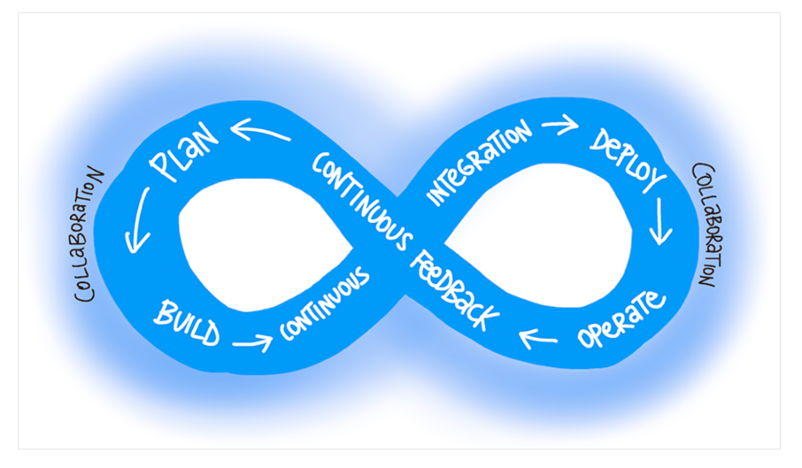

# What is DevOps?

The contraction of "Dev" and "Ops" refers to replacing siloed Development and Operations. 

The idea is to create multidisciplinary teams that now work together with shared and efficient practices and tools. 

Essential DevOps practices include agile planning, continuous integration, continuous delivery, and monitoring of applications. 

DevOps is a constant journey.

## Become data-informed

We recommend you use data to inform what to do in your next cycle. 

Many experience reports tell us that roughly one-third of the deployments will have negative business results. 

Approximately one-third will have positive results, and one-third will make no difference. 

Fail fast on effects that do not advance the business and double down on outcomes that support the business. Sometimes the approach is called pivot or persevere.

## Shorten your cycle time

When you adopt DevOps practices:

You shorten your cycle time by working in smaller batches.
* Using more automation.
* Hardening your release pipeline.
* Improving your telemetry.
* Deploying more frequently.

## Explore the DevOps journey

* Continuous Integration drives the ongoing merging and testing of code, which leads to finding defects early. Other benefits include less time wasted on fighting merge issues and rapid feedback for development teams.

* Continuous Delivery of software solutions to production and testing environments helps organizations quickly fix bugs and respond to ever-changing business requirements.

* Version Control, usually with a Git-based Repository, enables teams located anywhere in the world to communicate effectively during daily development activities. Also, integrate with software development tools for monitoring activities such as deployments.

* Use Agile planning and lean project management techniques to:
  * Plan and isolate work into sprints.
  * Manage team capacity and help teams quickly adapt to changing business needs.
  * A DevOps Definition of Done is working software collecting telemetry against the intended business goals.

* Monitoring and Logging of running applications. Including production environments for application health and customer usage. It helps organizations create a hypothesis and quickly validate or disprove strategies. Rich data is captured and stored in various logging formats.

* Public and Hybrid Clouds have made the impossible easy. The cloud has removed traditional bottlenecks and helped commoditize Infrastructure. You can use Infrastructure as a Service (IaaS) to lift and shift your existing apps or Platform as a Service (PaaS) to gain unprecedented productivity. The cloud gives you a data center without limits.

* Infrastructure as Code (IaC): Enables the automation and validation of the creation and teardown of environments to help with delivering secure and stable application hosting platforms.

* Use Microservices architecture to isolate business use cases into small reusable services that communicate via interface contracts. This architecture enables scalability and efficiency.

* Containers are the next evolution in virtualization. They are much more lightweight than virtual machines, allow much faster hydration, and easily configure files.

## Explore shared goals

* Reduce the time spent on fixing bugs by 60%.
* Reduce the time spent on unplanned work by 70%.
* Reduce the out-of-hours work required by staff to no more than 10% of total working time.
* Remove all direct patching of production systems.

[Donovan Brown | What is DevOps?](https://www.donovanbrown.com/post/what-is-devops)

[What is DevOps? - Azure DevOps | Microsoft Docs](https://docs.microsoft.com/en-us/devops/what-is-devops)

[View of features and epics on the Feature Timeline - Azure DevOps | Microsoft Docs](https://docs.microsoft.com/en-us/azure/devops/boards/extensions/feature-timeline)

[Plan and track work in Azure Boards with Basic or Agile processes - Azure Boards | Microsoft Docs](https://docs.microsoft.com/en-us/azure/devops/boards/get-started/plan-track-work)

[Agile Manifesto for Software Development | Agile Alliance](https://www.agilealliance.org/agile101/the-agile-manifesto)

[12 Principles Behind the Agile Manifesto | Agile Alliance](https://www.agilealliance.org/agile101/12-principles-behind-the-agile-manifesto)