# Structure your Git Repo 


### Explore monorepo versus multiple repos

A repository is simply a place where the history of your work is stored. It often lives in a .git subdirectory of your working copy.

However, what's the best way to organize your code repository? Software development teams start with the best intentions to keep a clear separation of concerns in both the software being developed and their code repositories.

It's not uncommon for the code repositories to be bloated with unrelated code and artifacts over time.

There are two philosophies on organizing your repos: Monorepo or Multiple repos.

Monorepos is a source control pattern where all the source code is kept in a single repository. It's super simple to give all your employee's access to everything in one shot. Just clone it down and done.
Multiple repositories refer to organizing your projects each into their separate repository.
The fundamental difference between the monorepo and multiple repos philosophies boils down to a difference about what will allow teams working together on a system to go fastest.

The multiple repos view, in extreme form, is that if you let every subteam live in its repo.

They have the flexibility to work in their area however they want, using whatever libraries, tools, development workflow, and so on, will maximize their productivity.

The cost is that anything not developed within a given repo must be consumed as if it was a third-party library or service. It would be the same even if it were written by the person sitting one desk over.

If you find a bug in a library you use, you must fix it in the appropriate repo. Get a new artifact published, and then return to your repo to change your code.

You must deal with a different code base, various libraries, and tools, or even a different workflow in the other repo.

Or maybe you must ask someone who owns that system to make the change for you and wait for them to get around to it.

The monorepo view the friction, especially when dealing with more complicated dependency graphs, is much more costly than multiple repos advocates recognize.

The productivity gains to be had by letting different teams go their way aren't that significant.

While some teams may find a locally optimal way of working, it may be the case. It's also likely that other teams will offset their gains by choosing a suboptimal way of working.

By putting all your eggs in the one basket of the monorepo, you can then afford to invest in watching that basket carefully.

The friction of having to make changes in other repos. Or, worse, having to wait for other teams to make changes for you. It's primarily avoided in a mono repo because anyone can (and is encouraged) to change anything.

If you find a bug in a library, you can fix it and get on with your life. It's no more friction than if you had found a bug in your code.


### Azure DevOps project repositories

In Azure DevOps, a project can contain multiple repositories. It's common to use one repository for each associated solution.

### Implement a change log

The concept of a changelog is simple enough: It's a file that has a list of changes made to a project, usually in date order. The typical breakdown is to separate a list of versions, and then within each version, show:

Added features
Modified/Improved features
Deleted features
Some teams will post changelogs as blog posts; others will create a CHANGELOG.md file in a GitHub repository.


### Automated change log tooling

While changelogs can be created and manually maintained, you might want to consider using an automated changelog creation tool. At least as a starting point.

### Using native GitHub commands

The git log command can be useful for automatically creating content. Example: create a new section per version:

```
git log [options] vX.X.X..vX.X.Y | helper-script > projectchangelogs/X.X.Y
```

### Git changelog

One standard tool is [gitchangelog](https://pypi.org/project/gitchangelog/). This tool is based on Python.


### GitHub changelog generator

Another standard tool is called [github-changelog-generator.](https://github.com/github-changelog-generator/github-changelog-generator)

```
$ github_changelog_generator -u github-changelog-generator -p TimerTrend-3.0
```


# Manage Git branches and workflows

## What is a successful Git branch workflow?

When evaluating a workflow for your team, you must consider your team's culture. You want the workflow to enhance your team's effectiveness and not be a burden that limits productivity. Some things to consider when evaluating a Git workflow are:

Does this workflow scale with team size?
Is it easy to undo mistakes and errors with this workflow?
Does this workflow impose any new unnecessary cognitive overhead on the team?

### Common branch workflows

Most popular Git workflows will have some sort of centralized repo that individual developers will push and pull from.

Below is a list of some popular Git workflows that we'll go into more detail about in the next section.

These comprehensive workflows offer more specialized patterns about managing branches for feature development, hotfixes, and eventual release.


### Trunk-based development

Trunk-based development is a logical extension of Centralized Workflow.

The core idea behind the Feature Branch Workflow is that all feature development should take place in a dedicated branch instead of the main branch.

This encapsulation makes it easy for multiple developers to work on a particular feature without disturbing the main codebase.

It also means the main branch should never contain broken code, which is a huge advantage for continuous integration environments.


### GitFlow workflow

The GitFlow workflow was first published in a highly regarded 2010 blog post from [Vincent Driessen at nvie.](https://nvie.com/posts/a-successful-git-branching-model/)

The Gitflow Workflow defines a strict branching model designed around the project release.

This workflow doesn't add any new concepts or commands beyond what's required for the Feature Branch Workflow.

Instead, it assigns particular roles to different branches and defines how and when they should interact.


### Forking workflow

The Forking Workflow is fundamentally different than the other workflows discussed in this tutorial.

Instead of using a single server-side repository to act as the "central" codebase, it gives every developer a server-side repository.

It means that each contributor has two Git repositories:

* A private local one.
* A public server-side one.


### Explore feature branch workflow

The core idea behind the Feature Branch Workflow is that all feature development should take place in a dedicated branch instead of the main branch.

The encapsulation makes it easy for multiple developers to work on a particular feature without disturbing the main codebase.

It also means the main branch will never contain broken code, which is a huge advantage for continuous integration environments.

Encapsulating feature development also makes it possible to use pull requests, which are a way to start discussions around a branch.

They allow other developers to sign out on a feature before it gets integrated into the official project.

Or, if you get stuck in the middle of a feature, you can open a pull request asking for suggestions from your colleagues.

The point is, pull requests make it incredibly easy for your team to comment on each other's work.

Also, feature branches can (and should) be pushed to the central repository.

It makes it possible to share a feature with other developers without touching any official code.

Since the main is the only "special" branch, storing several feature branches on the central repository doesn't pose any problems.

It's also a convenient way to back up everybody's local commits.

### Trunk-based development workflow

The trunk-based development Workflow assumes a central repository, and the main represents the official project history.

Instead of committing directly to their local main branch, developers create a new branch every time they start work on a new feature.

Feature branches should have descriptive names, like new-banner-images or bug-91. The idea is to give a clear, highly focused purpose to each branch.

Git makes no technical distinction between the main branch and feature branches, so developers can edit, stage, and commit changes to a feature branch.

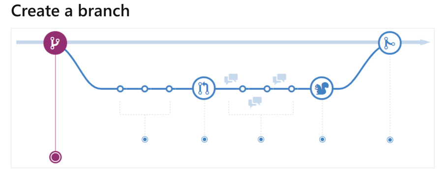

When you're working on a project, you're going to have many different features or ideas in progress at any given time – some of which are ready to go and others that aren't.

Branching exists to help you manage this workflow.

When you create a branch in your project, you're creating an environment where you can try out new ideas.

Changes you make on a branch don't affect the main branch, so you're free to experiment and commit changes, safe in the knowledge that your branch won't be merged until it's ready to be reviewed by someone you're collaborating with.

Branching is a core concept in Git, and the entire branch flow is based upon it. There's only one rule: anything in the main branch is always deployable.

Because of this, your new branch must be created off main when working on a feature or a fix.

Your branch name should be descriptive (for example, refactor-authentication, user-content-cache-key, make-retina-avatars) so that others can see what is being worked on.

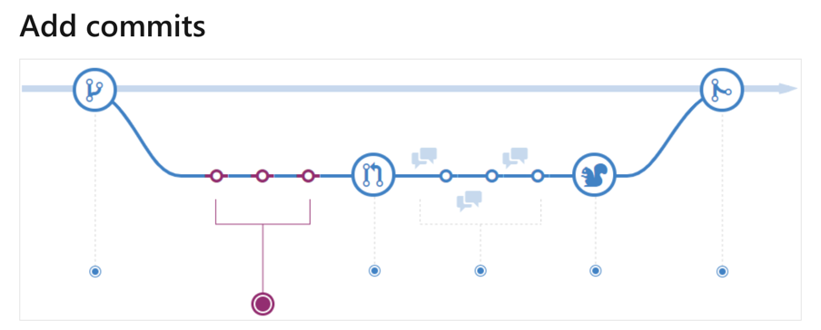

Once your branch has been created, it's time to start making changes. Whenever you add, edit, or delete a file, you're making a commit and adding them to your branch.

This process of adding commits keeps track of your progress as you work on a feature branch.

Commits also create a transparent history of your work that others can follow to understand what you've done and why.

Each commit has an associated commit message, which explains why a particular change was made.

Furthermore, each commit is considered a separate unit of change. It lets you roll back changes if a bug is found or you decide to head in a different direction.

Commit messages are essential, especially since Git tracks your changes and then displays them as commits once they're pushed to the server.

By writing clear commit messages, you can make it easier for other people to follow along and provide feedback.

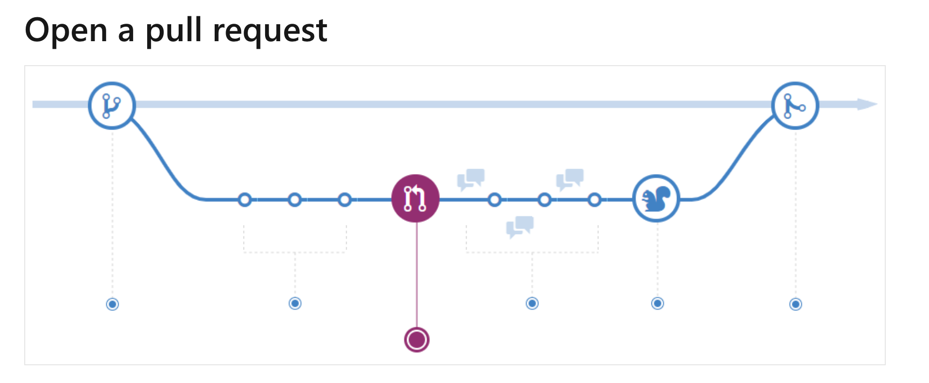

Pull Requests start discussion about your commits. Because they're tightly integrated with the underlying Git repository, anyone can see exactly what changes would be merged if they accept your request.

You can open a Pull Request at any point during the development process when:

* You've little or no code but want to share some screenshots or general ideas.
* You're stuck and need help or advice.
* You're ready for someone to review your work.

Using the @mention system in your Pull Request message, you can ask for feedback from specific people or teams, whether they're down the hall or 10 time zones away.

Pull Requests help contribute to projects and for managing changes to shared repositories.

If you're using a Fork & Pull Model, Pull Requests provide a way to notify project maintainers about the changes you'd like them to consider.

If you're using a Shared Repository Model, Pull Requests help start code review and conversation about proposed changes before they're merged into the main branch.

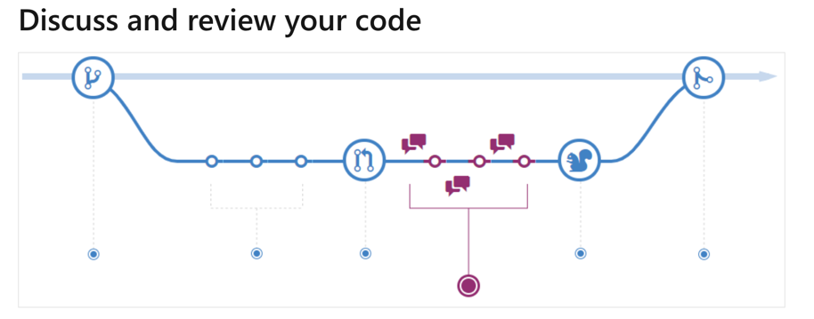

Once a Pull Request has been opened, the person or team reviewing your changes may have questions or comments.

Perhaps the coding style doesn't match project guidelines, the change is missing unit tests, or maybe everything looks excellent, and props are in order.

Pull Requests are designed to encourage and capture this type of conversation.

You can also continue to push to your branch, considering discussion and feedback about your commits.

Suppose someone comments that you forgot to do something, or if there's a bug in the code, you can fix it in your branch and push up the change.

Git will show your new commits and any other feedback you may receive in the unified Pull Request view.

Pull Request comments are written in Markdown, so you can embed images and emoji, use pre-formatted text blocks, and another lightweight formatting.

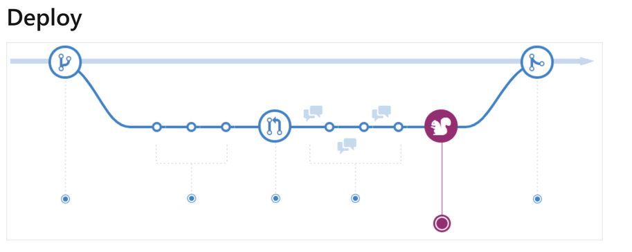

With Git, you can deploy from a branch for final testing in an environment before merging to main.

Once your pull request has been reviewed and the branch passes your tests, you can deploy your changes to verify them. If your branch causes issues, you can roll it back by deploying the existing main.

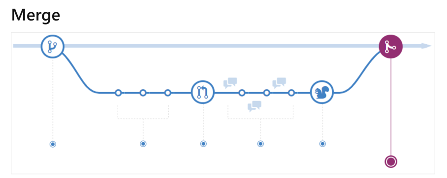

Now that your changes have been verified, it's time to merge your code into the main branch.

Once merged, Pull Requests preserve a record of the historical changes to your code. Because they're searchable, they let anyone go back in time to understand why and how a decision was made.

By incorporating specific keywords into the text of your Pull Request, you can associate issues with code. When your Pull Request is merged, the related issues can also close.

This workflow helps organize and track branches that are focused on business domain feature sets.

Other Git workflows like the Git Forking Workflow and the Gitflow Workflow are repo-focused and can use the Git Feature Branch Workflow to manage their branching models.


# Explore Git branch model for continuous delivery

The purpose of writing code is to ship enhancements to your software.

A branching model that introduces too much process overhead doesn't help increase the speed of getting changes to customers.

That's essential to develop a branching model that gives you enough padding not to ship poor-quality changes. But, at the same time doesn't introduce too many processes to slow you down.

The internet is full of branching strategies for Git; while there's no right or wrong, a perfect branching strategy works for your team!

You'll learn always to use the combination of feature branches and pull requests to have a ready-to-ship main branch. Also, sync bug fixed in a fix of fail branches back into main to avoid regression.


## Getting ready

* The main branch:
    * The main branch is the only way to release anything to production.
    * The main branch should always be in a ready-to-release state.
    * Protect the main branch with branch policies.
    * Any changes to the main branch flow through pull requests only.
    * Tag all releases in the main branch with Git tags.

* The feature branch:
    * Use feature branches for all new features and bug fixes.
    * Use feature flags to manage long-running feature branches.
    * Changes from feature branches to the main only flow through pull requests.
    * Name your feature to reflect their purpose

List of branches:

```
features/feature-area/feature-name
users/username/description
users/username/workitem
bugfix/description
features/feature-name
features/feature-area/feature-name
hotfix/description
```

* Pull requests:
    * Review and merge code with pull requests. 
    * Automate what you inspect and validate as part of pull requests.
    * Tracks pull request completion duration and set goals to reduce the time it takes.

We'll be using the myWebApp created in the previous exercises. In this recipe, we'll be using three trendy extensions from the marketplace


## How to do it

1.After you've cloned the main branch into a local repository, create a new feature branch, myFeature-1:

````
myWebApp> git checkout -b feature/myFeature-1
Switched to a new branch 'feature/myFeature-1'
````
2.Run the Git branch command to see all the branches, the branch showing up with asterisk is the "currently-checked-out" branch:

```
myWebApp> git branch * feature/myFeature-1  main
```

3.Make a change to the Program.cs file in the feature/myFeature-1 branch:

```
myWebApp> notepad Program.cs
```

4.Stage your changes and commit locally, then publish your branch to remote:

```
myWebApp> git status
On branch feature/myFeature-1 Changes not staged for commit: (use "git add <file>..." to update what will be committed) (use "git checkout -- <file>..." to discard changes in working directory) modified: Program.cs
myWebApp> git add .
myWebApp> git commit -m "Feature 1 added to Program.cs"

[feature/myFeature-1 70f67b2] feature 1 added to program.cs 1 file changed, 1 insertion(+)

myWebApp> git push -u origin feature/myFeature-1

Delta compression using up to 8 threads. Compressing objects: 100% (3/3), done. Writing objects: 100% (3/3), 348 bytes | 348.00 KiB/s, done. Total 3 (delta 2), reused 0 (delta 0) remote: Analyzing objects... (3/3) (10 ms) remote: Storing packfile... done (44 ms) remote: Storing index... done (62 ms) To http://dev.azure.com/Geeks/PartsUnlimited/_git/MyWebApp * [new branch] feature/myFeature-1 -> feature/myFeature-1 Branch feature/myFeature-1 set up to track remote branch feature/myFeature-1 from origin.
```

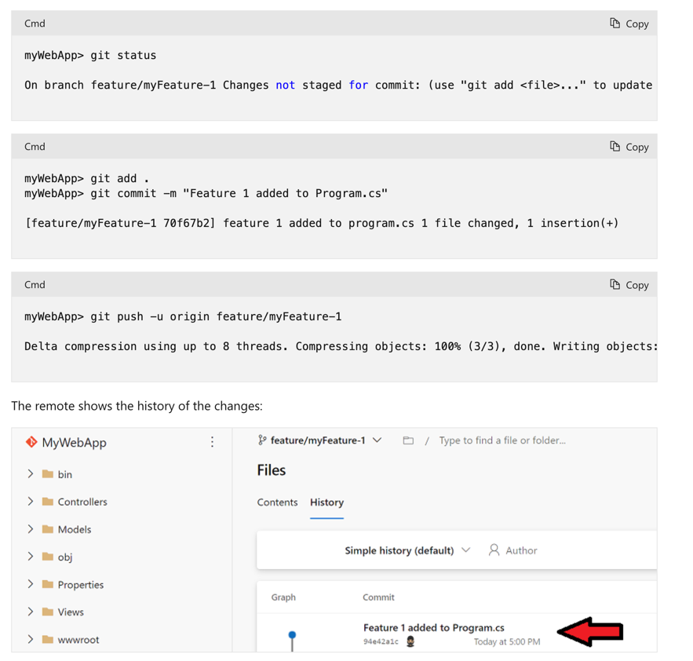

5.Create a new pull request (using the Azure DevOps CLI) to review the changes in the feature-1 branch:

```
az repos pr create --title "Review Feature-1 before merging to main" --work-items 38 39 `
          -d "#Merge feature-1 to main" `
          -s feature/myFeature-1 -t main -r myWebApp -p
  $prj -i $i
```
Use the --open switch when raising the pull request to open the pull request in a web browser after it has been created. The --deletesource-branch switch can be used to delete the branch after the pull request is complete. Also, consider using --auto-complete to complete automatically when all policies have passed, and the source branch can be merged into the target branch.

The team jointly reviews the code changes and approves the pull request:

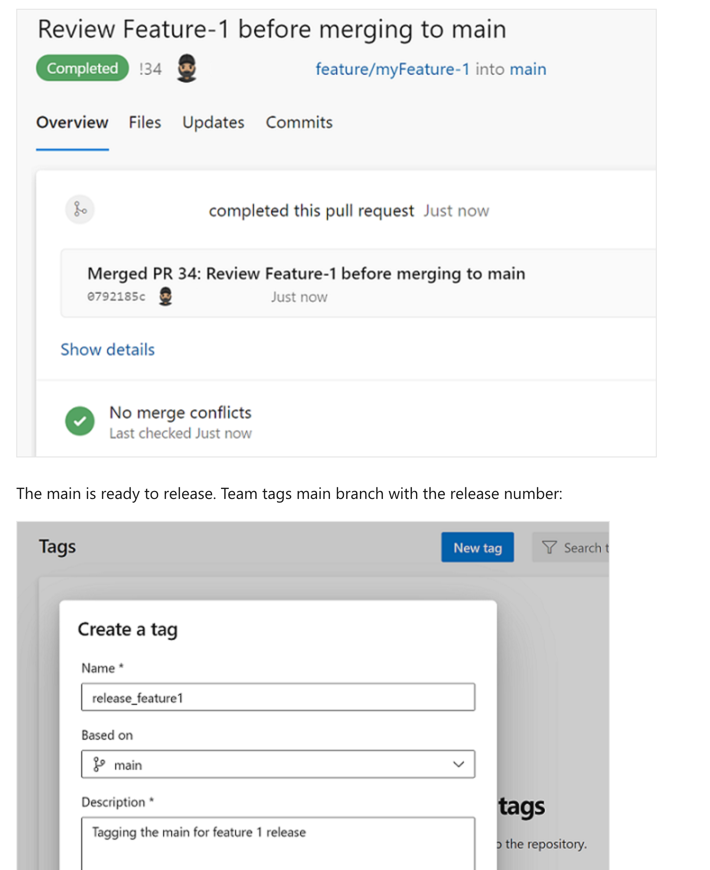

6.Start work on Feature 2. Create a branch on remote from the main branch and do the checkout locally:

```
myWebApp> git push origin origin:refs/heads/feature/myFeature-2

Total 0 (delta 0), reused 0 (delta 0) To https://dev.azure.com/Geeks/PartsUnlimited/_git/MyWebApp * [new branch] origin/HEAD -> refs/heads/feature/myFeature-2

myWebApp> git checkout feature/myFeature-2

Switched to a new branch 'feature/myFeature-2' Branch feature/myFeature-2 set up to track remote branch feature/myFeature-2 from origin.
```


## How it works

We learned how the Git branching model gives you the flexibility to work on features in parallel by creating a branch for each feature.

The pull request workflow allows you to review code changes using the branch policies.

Git tags are a great way to record milestones, such as the version of code released; tags give you a way to create branches from tags.

We created a branch from a previous release tag to fix a critical bug in production.

The branches view in the web portal makes it easy to identify branches ahead of the main. Also, it forces a merge conflict if any ongoing pull requests try to merge to the main without resolving the merge conflicts.

A lean branching model, such as this, allows you to create short-lived branches and push quality changes to production faster.


[ContD](https://docs.microsoft.com/en-us/learn/modules/manage-git-branches-workflows/4-explore-git-branch-model-for-continuous-delivery)


# Explore GitFlow branch workflow

Gitflow Workflow is a Git workflow design first published and made famous by Vincent Driessen at nvie.

The Gitflow Workflow defines a strict branching model designed around the project release. It provides a robust framework for managing more significant projects.

Gitflow is ideally suited for projects that have a scheduled release cycle.

This workflow doesn't add any new concepts or commands beyond what's required for the Feature Branch Workflow.

Instead, it assigns particular roles to different branches and defines how and when they should interact.

Also, to feature branches, it uses individual branches for preparing, maintaining, and recording releases.

You also get to use all the benefits of the Feature Branch Workflow: pull requests, isolated experiments, and more efficient collaboration.

Also, to the abstract Gitflow Workflow idea, a more tangible git-flow toolset is available, which integrates with Git to provide specialized Gitflow Git command-line tool extensions.


## Getting started

Gitflow is just an abstract idea of a Git workflow. It means it dictates what kind of branches to set up and how to merge them. We'll touch on the purposes of the branches below.

The git-flow toolset is an essential command-line tool that has an installation process. The installation process for git-flow is straightforward. Packages for git-flow are available on multiple operating systems.

On OSX systems, you can execute brew install git-flow.

On windows, you'll need to download and install git-flow.

After installing git-flow, you can use it in your project by running git flow init. Git-flow is a wrapper around Git.

The git flow init command is an extension of the default git init command. It doesn't change anything in your repository other than creating branches for you.

How it works:

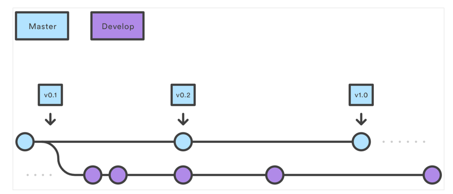

## Develop and main branches

Instead of a single main branch, this workflow uses two branches to record the project's history.

The main branch stores the official release history, and the develop branch serves as an integration branch for features. It's also convenient to tag all commits in the main branch with a version number.

The first step is to complement the default main with a develop branch. A simple way to do it is for one developer to create an empty develop branch locally and push it to the server:

```
git branch develop
git push -u origin develop
```

This branch will contain the project's complete history, but the main will have an abridged version. Other developers should now clone the central repository and create a tracking branch for develop.

When using the git-flow extension library, executing git flow init on an existing repo will create the develop branch:

```
Initialized empty Git repository in ~/project/.git/
No branches exist yet. Base branches must be created now.
Branch name for production releases: [main]
Branch name for "next release" development: [develop]

How to name your supporting branch prefixes?
Feature branches? [feature/]
Release branches? [release/]
Hotfix branches? [hotfix/]
Support branches? [support/]
Version tag prefix? []

$ git branch

* develop
main
```

## Feature branches

Each new feature should be in its branch, which can be pushed to the central repository for backup/collaboration.

But, instead of branching off main, feature branches use develop as their parent branch.

When a feature is complete, it gets merged back into develop. Features should never interact directly with the main.

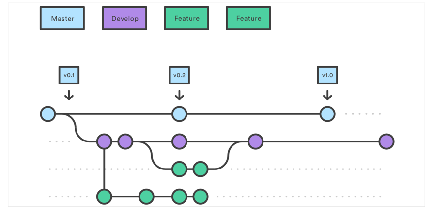

Feature branches combined with the develop branch are the Feature Branch Workflow. But the Gitflow Workflow doesn't stop there.

Feature branches are created off to the latest develop branch.

Creating a feature branch Without the git-flow extensions:

```
git checkout develop
git checkout -b feature_branch
```

When using the git-flow extension:

```
git flow feature start feature_branch
```

Continue your work and use Git like you usually would.

Finishing a feature branch When you're done with the development work on the feature, the next step is to merge the feature_branch into develop.

Without the git-flow extensions:

```
git checkout develop
git merge feature_branch
```

Using the git-flow extensions:

```
git flow feature finish feature_branch
```

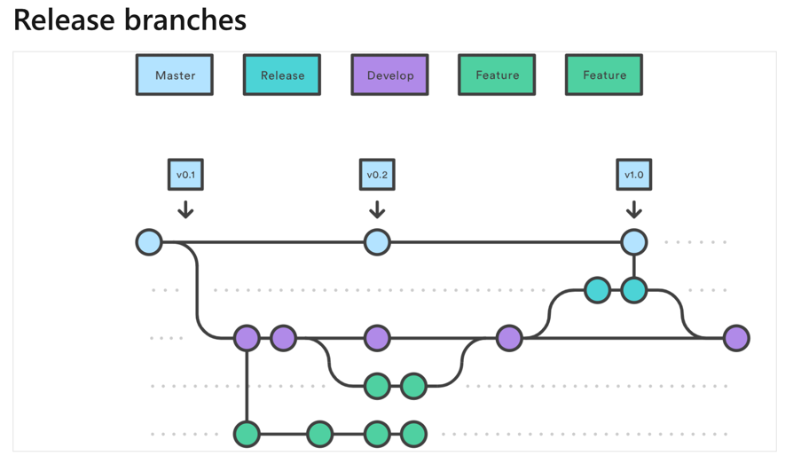

Once develop has acquired enough features for a release (or a predetermined release date is approaching), you fork a release branch off develop.

Creating this branch starts the next release cycle, so no new features can be added after this point—only bug fixes, documentation generation, and other release-oriented tasks should go in this branch.

Once it's ready to ship, the release branch gets merged into main and tagged with a version number.

Also, it should be merged back into develop, which may have progressed since the release was started.

Using a dedicated branch to prepare releases allows one team to polish the current release while another team continues working on features for the next release.

It also creates well-defined phases of development. For example, it's easy to say, "This week we're preparing for version 4.0," and to see it in the repository structure.

Making release branches is another straightforward branching operation. Like feature branches, release branches are based on the develop branch.

A new release branch can be created using the following methods.

Without the git-flow extensions:


```
git checkout develop
git checkout -b release/0.1.0
``` cmd

When using the git-flow extensions:

``` cmd
$ git flow release start 0.1.0
Switched to a new branch 'release/0.1.0'
```

Once the release is ready to ship, it will get merged into main and develop. Then the release branch will be deleted.

It's essential to merge back into develop because critical updates may have been added to the release branch. Also, they need to be accessible to new features.

If your organization stresses code review, it would be an ideal place for a pull request.

To finish a release branch, use the following methods:

Without the git-flow extensions:

```
git checkout develop
git merge release/0.1.0
```

Or with the git-flow extension:

```
git checkout main
git checkout merge release/0.1.0
git flow release finish '0.1.0'
```

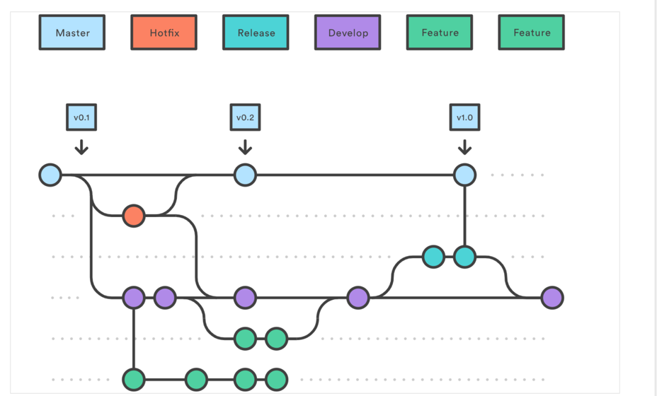

Maintenance or "hotfix" branches are used to patch production releases quickly. Hotfix branches are like release branches and feature branches, except they're based on main instead of develop.

It's the only branch that should fork directly off main.

Once the fix is complete, it should be merged into both main and develop. Or the current release branch.

Also, the main should be tagged with an updated version number.

Having a dedicated line of development for bug fixes lets your team address issues without interrupting the rest of the workflow. Or waiting for the next release cycle.

You can think of maintenance branches as improvised release branches that work directly with the main. A hotfix branch can be created using the following methods:

Without the git-flow extensions:

```
git checkout main
git checkout -b hotfix_branch
```

When using the git-flow extensions:

```
$ git flow hotfix start hotfix_branch
```

Like finishing a release branch, a hotfix branch gets merged into both main and develop.

```
git checkout main
git merge hotfix_branch
git checkout develop
git merge hotfix_branch
git branch -D hotfix_branch
$ git flow hotfix finish hotfix_branch
```

Some key takeaways to know about Gitflow are:

The workflow is great for a release-based software workflow.
Gitflow offers a dedicated channel for hotfixes to production.

The overall flow of Gitflow is:

* A develop branch is created from the main.
* A release branch is created from develop.
* Feature branches are created from develop.
* When a feature is complete, it's merged into the develop branch.
* When the release branch is done, it's merged into develop and main.
* If an issue in the main is detected, a hotfix branch is created from the main.
* Once the hotfix is complete, it's merged to both develop and main.

## Explore fork workflow

The forking workflow is fundamentally different than other popular Git workflows.

Instead of using a single server-side repository to act as the "central" codebase, it gives every developer their server-side repository.

It means that each contributor has two Git repositories:

A private local.
A public server-side.
The forking workflow is most often seen in public open-source projects.

The main advantage of the forking workflow is that contributions can be integrated without the need for everybody to push to a single central repository.

Developers push to their server-side repositories, and only the project maintainer can push to the official repository.

It allows the maintainer to accept commits from any developer without giving them write access to the official codebase.

The forking workflow typically follows a branching model based on the Gitflow workflow.

It means that complete feature branches will be intended for merging into the original project maintainer's repository.

The result is a distributed workflow that provides you a flexible way for large, organic teams (including untrusted third parties) to collaborate securely.

This also makes it an ideal workflow for open-source projects.

## How it works

As in the other Git workflows, the forking workflow begins with an official public repository stored on a server.

But when a new developer wants to start working on the project, they don't directly clone the official repository.

Instead, they fork the official repository to create a copy of it on the server.

This new copy serves as their personal public repository—no other developers can push to it, but they can pull changes from it (we'll see why this is necessary in a moment).

After they've created their server-side copy, the developer does a git clone to get a copy of it onto their local machine.

It serves as their private development environment, just like in the other workflows.

When they're ready to publish a local commit, they push the commit to their public repository—not the official one.

Then, they file a pull request with the main repository, which lets the project maintainer know that an update is ready to be integrated.

The pull request also serves as a convenient discussion thread if there are issues with the contributed code.

The following is a step-by-step example of this workflow:

* A developer 'forks' an 'official' server-side repository. It creates their server-side copy.
* The new server-side copy is cloned to their local system.
* A Git remote path for the 'official' repository is added to the local clone.
* A new local feature branch is created.
* The developer makes changes to the new branch.
* New commits are created for the changes.
* The branch gets pushed to the developer's server-side copy.
* The developer opens a pull request from the new branch to the 'official' repository.
* The pull request gets approved for merge and is merged into the original server-side repository.

To integrate the feature into the official codebase:

* The maintainer pulls the contributor's changes into their local repository.
* Checks to make sure it doesn't break the project.
* Merges it into their local main branch.
* Pushes the main branch to the official repository on the server.

The contribution is now part of the project, and other developers should pull from the official repository to synchronize their local repositories.

It's essential to understand that the notion of an "official" repository in the forking workflow is merely a convention.

The only thing that makes the official repository, so official is that it's the repository of the project maintainer.

## Forking vs. cloning

It's essential to note that "forked" repositories and "forking" aren't special operations.

Forked repositories are created using the standard git clone command. Forked repositories are generally "server-side clones" managed and hosted by a Git service provider such as Azure Repos.

There's no unique Git command to create forked repositories.

A clone operation is essentially a copy of a repository and its history.


# Collaborate with pull requests in Azure Repos 


### Collaborate with pull requests

Pull requests let you tell others about changes you've pushed to a GitHub repository.

Once a pull request is sent, interested parties can review the set of changes, discuss potential modifications, and even push follow-up commits if necessary.

Pull requests are commonly used by teams and organizations collaborating using the Shared Repository Model.

Everyone shares a single repository, and topic branches are used to develop features and isolate changes.

Many open-source projects on GitHub use pull requests to manage changes from contributors.

They help provide a way to notify project maintainers about changes one has made.

Also, start code review and general discussion about a set of changes before being merged into the main branch.

Pull requests combine the review and merge of your code into a single collaborative process.

Once you're done fixing a bug or new feature in a branch, create a new pull request.

Add the team members to the pull request so they can review and vote on your changes.

Use pull requests to review works in progress and get early feedback on changes.

There's no commitment to merge the changes as the owner can abandon the pull request at any time.

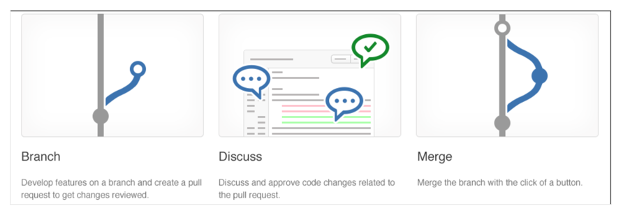

### Get your code reviewed

The code review done in a pull request isn't just to find bugs—that's what your tests are concerning.

A good code review catches less obvious problems that could lead to costly issues later.

Code reviews help protect your team from bad merges and broken builds that sap your team's productivity.

The review catches these problems before the merge, protecting your essential branches from unwanted changes.

Cross-pollinate expertise and spread problem-solving strategies by using a wide range of reviewers in your code reviews.

Diffusing skills and knowledge makes your team more robust and more resilient.

### Give great feedback

High-quality reviews start with high-quality feedback. The keys to great feedback in a pull request are:

* Have the right people review the pull request.
* Make sure that reviewers know what the code does.
* Give actionable, constructive feedback.
* Reply to comments promptly.

When assigning reviewers to your pull request, make sure you select the right set of reviewers.

You want reviewers who know how your code works and try to include developers working in other areas to share their ideas.

Also, who can provide a clear description of your changes and build your code that has your fix or feature running in it.

Reviewers should try to provide feedback on changes they disagree with. Identify the issue and give a specific suggestion on what you would do differently.

This feedback has clear intent and is easy for the owner of the pull request to understand.

The pull request owner should reply to the comments, accept the suggestion, or explain why the suggested change isn't ideal.

Sometimes a suggestion is good, but the changes are outside the scope of the pull request.

Take these suggestions and create new work items and feature branches separate from the pull request to make those changes.

### Protect branches with policies

There are a few critical branches in your repo that the team relies on always in suitable shapes, such as your main branch.

Require pull requests to make any changes on these branches. Developers pushing changes directly to the protected branches will have their pushes rejected.

Add more conditions to your pull requests to enforce a higher level of code quality in your key branches.

A clean build of the merged code and approval from multiple reviewers are extra requirements you can set to protect your key branches.


### Exercise - Azure Repos collaborating with pull requests

Code issues that are found sooner are both easier and cheaper to fix. So development teams strive to push code quality checks as far left into the development process as possible.

As the name suggests, branch policies give you a set of out-of-the-box policies that can be applied to the branches on the server.

Any changes being pushed to the server branches need to follow these policies before the changes can be accepted.

Policies are a great way to enforce your team's code quality and change-management standards. In this recipe, you'll learn how to configure branch policies on your main branch.

### Getting ready

The out-of-the-box branch policies include several policies, such as build validation and enforcing a merge strategy. We'll only focus on the branch policies needed to set up a code-review workflow in this recipe.

### How to do it

1. Open the branches view for the myWebApp Git repository in the parts-unlimited team portal. Select the main branch, and from the pull-down, context menu choose Branch policies:

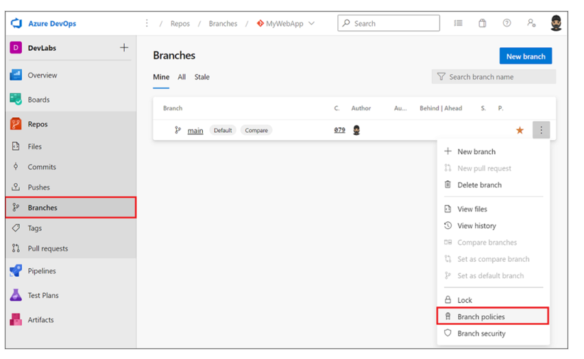

2. In the policies view, It presents out-of-the-box policies. Set the minimum number of reviewers to 1:

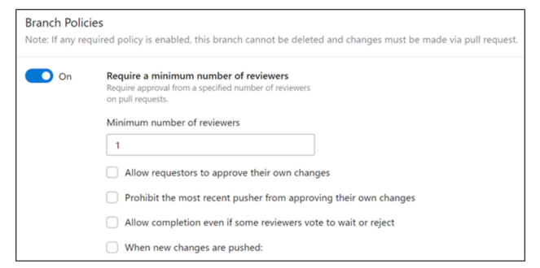

The Allow requestors to approve their own changes option allows the submitter to self-approve their changes.

It's OK for mature teams, where branch policies are used as a reminder for the checks that need to be performed by the individual.

3. Use the review policy with the comment-resolution policy. It allows you to enforce that the code review comments are resolved before the changes are accepted. The requester can take the feedback from the comment and create a new work item and resolve the changes. It at least guarantees that code review comments aren't lost with the acceptance of the code into the main branch: 

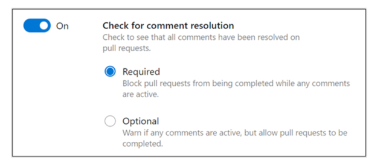

4. A requirement instigates a code change in the team project. If the work item triggered the work isn't linked to the change, it becomes hard to understand why it was made over time. It's especially useful when reviewing the history of changes. Configure the Check for linked work items policy to block changes that don't have a work item linked to them:

5. Select the option to automatically include reviewers when a pull request is raised automatically. You can map which reviewers are added based on the area of the code being changed:

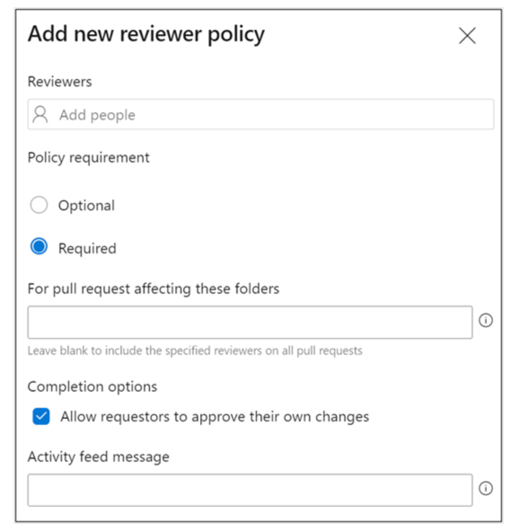

### How it works

With the branch policies in place, the main branch is now fully protected.

The only way to push changes to the main branch is by first making the changes in another branch and then raising a pull request to trigger the change-acceptance workflow.

Choose to create a new branch from one of the existing user stories in the work item hub.

By creating a new branch from a work item, that work item automatically gets linked to the branch.

You can optionally include more than one work item with a branch as part of the create workflow:

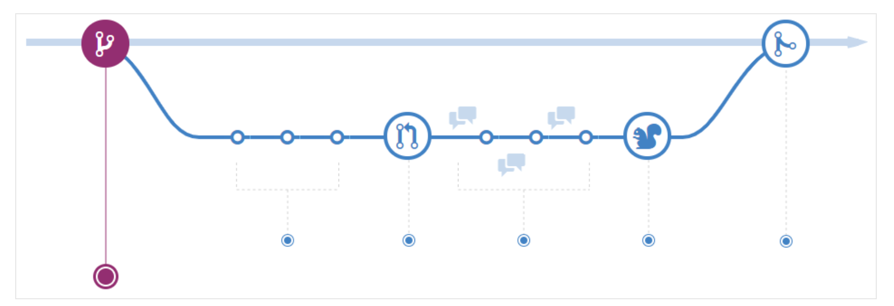

Prefix in the name when creating the branch to make a folder for the branch to go in.

In the preceding example, the branch will go in the folder. It is a great way to organize branches in busy environments.

With the newly created branch selected in the web portal, edit the HomeController.cs file to include the following code snippet and commit the changes to the branch.

In the image below, you'll see that you can directly commit the changes after editing the file by clicking the commit button.

The file path control in the team portal supports search.

Start typing the file path to see all files in your Git repository under that directory, starting with these letters showing up in the file path search results dropdown.

The code editor in the web portal has several new features in Azure DevOps Server, such as support for bracket matching and toggle white space.

You can load the command palette by pressing it. Among many other new options, you can now toggle the file using a file mini-map, collapse, and expand, and other standard operations.

To push these changes from the new branch into the main branch, create a pull request from the pull request view.

Select the new branch as the source and the main as the target branch.

The new pull request form supports markdown, so you can add the description using the markdown syntax.

The description window also supports @ mentions and # to link work items:

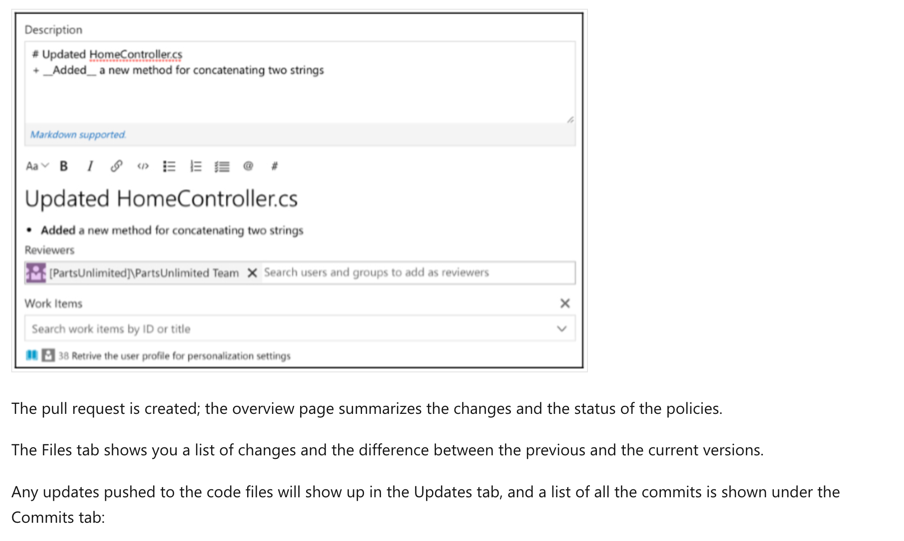

Open the Files tab: this view supports code comments at the line level, file level, and overall.

The comments support both @ for mentions and # to link work items, and the text supports markdown syntax:

The code comments are persisted in the pull request workflow; the code comments support multiple iterations of reviews and work well with nested responses.

The reviewer policy allows for a code review workflow as part of the change acceptance.

It's an excellent way for the team to collaborate on any code changes pushed into the main branch.

When the required number of reviewers approves the pull request, it can be completed.

You can also mark the pull request to autocomplete after your review. It autocompletes the pull requests once all the policies have been successfully compiled.

### There's more

Have you ever been in a state where a branch has been accidentally deleted? It can't be easy to figure out what happened.

Azure DevOps Server now supports searching for deleted branches. It helps you understand who deleted it and when. The interface also allows you to recreate the branch.

Deleted branches are only shown if you search for them by their exact name to cut out the noise from the search results.

To search for a deleted branch, enter the full branch name into the branch search box. It will return any existing branches that match that text.

You'll also see an option to search for an exact match in the list of deleted branches.

If a match is found, you'll see who deleted it and when. You can also restore the branch. Restoring the branch will re-create it at the commit to which is last pointed.

However, it won't restore policies and permissions.


Learn More

[About pull requests and permissions - Azure Repos | Microsoft Docs.](https://docs.microsoft.com/en-us/azure/devops/repos/git/about-pull-requests)
[Create a pull request to review and merge code - Azure Repos | Microsoft Docs.](https://docs.microsoft.com/en-us/azure/devops/repos/git/pull-requests)
[Review and comment on pull requests - Azure Repos | Microsoft Docs.](https://docs.microsoft.com/en-us/azure/devops/repos/git/review-pull-requests)
[Protect your Git branches with policies - Azure Repos | Microsoft Docs.](https://docs.microsoft.com/en-us/azure/devops/repos/git/branch-policies)
[Creating an issue or pull request - GitHub Docs.](https://docs.github.com/desktop/contributing-and-collaborating-using-github-desktop/working-with-your-remote-repository-on-github-or-github-enterprise/creating-an-issue-or-pull-request)


# Introduction to Git hooks

Continuous delivery demands a significant level of automation. You can't be continuously delivering if you don't have a quality codebase. It's where git fares so well.

It lets you automate most of the checks in your codebase. Even before committing the code into your local repository, let alone the remote.

## Git hooks

Git hooks are a mechanism that allows code to be run before or after certain Git lifecycle events.

For example, one could hook into the commit-msg event to validate that the commit message structure follows the recommended format.

The hooks can be any executable code, including shell, PowerShell, Python, or other scripts. Or they may be a binary executable. Anything goes!

The only criteria are that hooks must be stored in the .git/hooks folder in the repo root. Also, they must be named to match the related events (Git 2.x):

* applypatch-msg
* pre-applypatch
* post-applypatch
* pre-commit
* prepare-commit-msg
* commit-msg
* post-commit
* pre-rebase
* post-checkout
* post-merge
* pre-receive
* update
* post-receive
* post-update
* pre-auto-gc
* post-rewrite
* pre-push

## Practical use cases for using Git hooks

Since Git hooks execute the scripts on the specific event type they're called on, you can do much anything with Git hooks.

Some examples of where you can use hooks to enforce policies, ensure consistency, and control your environment:

* In Enforcing preconditions for merging
* Verifying work Item ID association in your commit message
* Preventing you & your team from committing faulty code
* Sending notifications to your team's chat room (Teams, Slack, HipChat, and so on.)

## So, where do I start?

Let's start by exploring client-side Git hooks.

Navigate to the repo.git\hooks directory.

You'll find that there are a bunch of samples, but they're disabled by default.

For instance, if you open that folder, you'll find a file called pre-commit.sample.

To enable it, rename it to pre-commit by removing the .sample extension and making the script executable.

When you attempt to commit using git commit, the script is found and executed.

If your pre-commit script exits with a 0 (zero), you commit successfully. Otherwise, the commit fails.

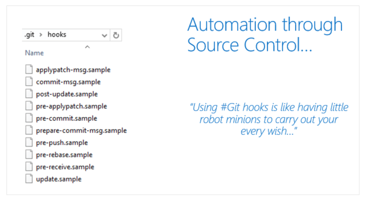

## PreCommit Git Hook to scan commit for keywords

How can Git hooks help with security?

You can invoke a script at pre-commit using Git hooks to scan the increment of code being committed into your local repository for specific keywords.

Replace the code in this pre-commit shell file with the below code.

```
#!C:/Program\ Files/Git/usr/bin/sh.exe
matches=$(git diff-index --patch HEAD | grep '^+' | grep -Pi 'password|keyword2|keyword3')
if [ ! -z "$matches" ]
then
    cat <<\EOT
Error: Words from the blocked list were present in the diff:
EOT
    echo $matches
    exit 1 
fi
```

You don't have to build the complete keyword scan list in this script.

You can branch off to a different file by referring it here to encrypt or scramble if you want to.

The repo .git\hooks folder isn't committed to source control, so you may ask how you share the goodness of the automated scripts you create with the team?

The good news is that from Git version 2.9, you can now map Git hooks to a folder that can be committed into source control.

You could do that by updating the global settings configuration for your git repository.

```
git config --global core.hooksPath '~/.GitHooks'
```

If you ever need to overwrite the Git Hooks, you have set up on the client-side. Also, you could do so by using the no-verify switch.

```
git commit --no-verify
```

## Server-side service hooks with Azure Repos

So far, we've looked at the client-side Git Hooks on Windows. Azure Repos also exposes server-side hooks. Azure DevOps uses the exact mechanism itself to create Pull requests. You can read more about it at the [Server hooks event reference.](https://docs.microsoft.com/en-us/azure/devops/service-hooks/events)

## Implement Git hooks

When pushing quality into the development process, developing code locally, you want developers to identify and catch code quality issues.

It's even before raising the pull request to trigger the branch policies.

Git hooks allow you to run custom scripts whenever certain important events occur in the Git life cycle—for example, committing, merging, and pushing.

Git ships with several sample hook scripts in the repo.git\hooks directory.

Since Git snares execute the contents on the particular occasion type they're approached, you can do practically anything with Git snares.

Here are a few instances of where you can use snares to uphold arrangements, guarantee consistency, and control your environment:

Enforcing preconditions for merging
Verifying work Item ID association in your commit message Preventing you and your team from committing faulty code
Sending notifications to your team's chat room (Teams, Slack, HipChat)
In this recipe, we'll use the pre-commit Git hook to scan the commit for keywords from a predefined list to block the commit if it contains any of these keywords.


# Plan foster inner source

## Explore foster inner source

The fork-based pull request workflow is popular with open-source projects because it allows anybody to contribute to a project.

You don't need to be an existing contributor or write access to a project to offer your changes.

This workflow isn't just for open source: forks also help support inner source workflows within your company.

Before forks, you could contribute to a project-using Pull Requests.

The workflow is simple enough: push a new branch up to your repository, open a pull request to get a code review from your team, and have Azure Repos evaluate your branch policies.

You can click one button to merge your pull request into main and deploy when your code is approved.

This workflow is great for working on your projects with your team. But what if you notice a simple bug in a different project within your company and you want to fix it yourself?

What if you're going to add a feature to a project that you use, but another team develops?

It's where forks come in; forks are at the heart of inner source practices.

## Inner source

Inner source – sometimes called "internal open source" – brings all the benefits of open-source software development inside your firewall.

It opens your software development processes so that your developers can easily collaborate on projects across your company.

It uses the same processes that are popular throughout the open-source software communities.

But it keeps your code safe and secure within your organization.

Microsoft uses the inner source approach heavily.

As part of the efforts to standardize a one-engineering system throughout the company – backed by Azure Repos – Microsoft has also opened the source code to all our projects to everyone within the company.


Before the move to the inner source, Microsoft was "siloed": only engineers working on Windows could read the Windows source code.

Only developers working on Office could look at the Office source code.

So, if you're an engineer working on Visual Studio and you thought that you found a bug in Windows or Office – or wanted to add a new feature – you're out of luck.

But by moving to offer inner sources throughout the company, powered by Azure Repos, it's easy to fork a repository to contribute back.

As an individual making the change, you don't need to write access to the original repository, just the ability to read it and create a fork.


## Implement the fork workflow

A fork is a copy of a repository. Forking a repository allows you to experiment with changes without affecting the original project freely.

Most commonly, forks are used to propose changes to someone else's project. Or use someone else's project as a starting point for your idea.

A fork is a complete copy of a repository, including all files, commits, and (optionally) branches.

Forks are a great way to support an Inner Source workflow: you can create a fork to suggest changes when you don't have permission to write to the original project directly.

Once you're ready to share those changes, it's easy to contribute them back-using pull requests.

## What's in a fork?

A fork starts with all the contents of its upstream (original) repository.

You can include all branches or limit them to only the default branch when you create a fork.

None of the permissions, policies, or build pipelines are applied.

The new fork acts as if someone cloned the original repository, then pushed it to a new, empty repository.

After a fork has been created, new files, folders, and branches aren't shared between the repositories unless a Pull Request (PR) carries them along.


## Sharing code between forks

You can create PRs in either direction: from fork to upstream or upstream to fork.

The most common approach will be from fork to upstream.

The destination repository's permissions, policies, builds, and work items will apply to the PR.

## Choosing between branches and forks

For a small team (2-5 developers), we recommend working in a single repo.

Everyone should work in a topic branch, and the main should be protected with branch policies.

As your team grows more significant, you may find yourself outgrowing this arrangement and prefer to switch to a forking workflow.

We recommend the forking workflow if your repository has many casual or infrequent committees (like an open-source project).

Typically, only core contributors to your project have direct commit rights into your repository.

It would help if you asked collaborators from outside this core set of people to work from a fork of the repository.

Also, it will isolate their changes from yours until you've had a chance to vet the work.

## The forking workflow

* Create a fork.
* Clone it locally.
* Make your changes locally and push them to a branch.
* Create and complete a PR to upstream.
* Sync your fork to the latest from upstream.

## Create the Fork


1.Navigate to the repository to fork and choose fork.

2.Specify a name and choose the project where you want the fork to be created. If the repository contains many topic branches, we recommend you fork only the default branch.

3.Choose the ellipsis, then Fork to create the fork.

```
You must have the Create Repository permission in your chosen project to create a fork. We recommend you create a dedicated project for forks where all contributors have the Create Repository permission. For an example of granting this permission, see Set Git repository permissions.
```

## Clone your fork locally

Once your fork is ready, clone it using the command line or an IDE like Visual Studio. The fork will be your origin remote.

For convenience, after cloning, you'll want to add the upstream repository (where you forked from) as a remote named upstream.

```
git remote add upstream {upstream_url}
```

## Make and push changes

It's possible to work directly in main - after all, this fork is your copy of the repo.

We recommend you still work in a topic branch, though.

It allows you to maintain multiple independent workstreams simultaneously.

Also, it reduces confusion later when you want to sync changes into your fork.

Make and commit your changes as you normally would. When you're done with the changes, push them to origin (your fork).

## Create and complete a PR

Open a pull request from your fork to the upstream. All the policies required reviewers and builds will be applied in the upstream repo. Once all policies are satisfied, the PR can be completed, and the changes become a permanent part of the upstream repo.

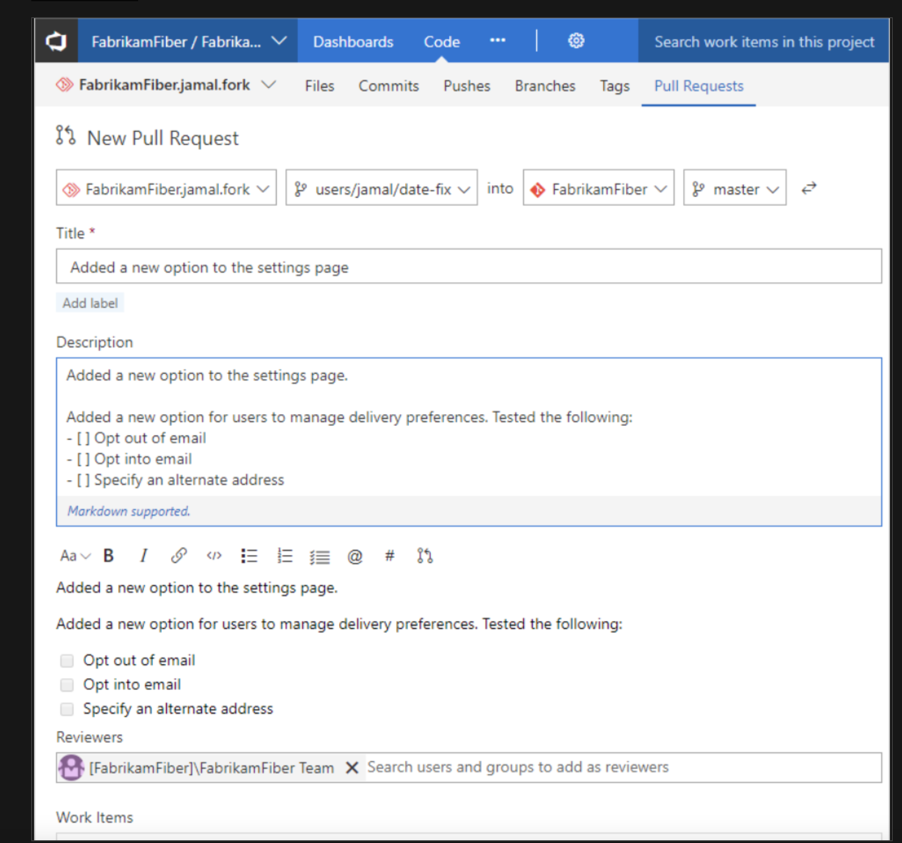

## Sync your fork to the latest

When you've gotten your PR accepted into upstream, you'll want to make sure your fork reflects the latest state of the repo.

We recommend rebasing on upstream's main branch (assuming main is the main development branch).

```
git fetch upstream main
git rebase upstream/main
git push origin
```

The forking workflow lets you isolate changes from the main repository until you're ready to integrate them. When you're ready, integrating code is as easy as completing a pull request.


## Describe inner source with forks

People fork repositories when they want to change the code in a repository that they don't have write access to.

If you don't have write access, you aren't part of the team contributing to that repository, so why would you modify the code repository?

In our line of work, we tend to look for technical reasons to improve something.

You may find a better way of implementing the solution or enhancing the functionality by contributing to or improving an existing feature.

You can fork repositories in the following situations:

I want to make a change.
I think the project is exciting and may want to use it in the future.
I want to use some code in that repository as a starting point for my project.
Software teams are encouraged to contribute to all projects internally, not just their software projects.

Forks are a great way to foster a culture of inner open source.

Forks are a recent addition to the Azure DevOps Git repositories.

This recipe will teach you to fork an existing repository and contribute changes upstream via a pull request.

## Getting ready

A fork starts with all the contents of its upstream (original) repository.

When you create a fork in the Azure DevOps, you can include all branches or limit them to only the default branch.

A fork doesn't copy the permissions, policies, or build definitions of the repository being forked.

After a fork has been created, the newly created files, folders, and branches aren't shared between the repositories unless you start a pull request.

Pull requests are supported in either direction: from fork to upstream or upstream to fork.

The most common approach for a pull request will be from fork to upstream.

## How to do it

1. Choose the Fork button (1), and then select the project where you want the fork to be created (2). Give your fork a name and choose the Fork button (3).

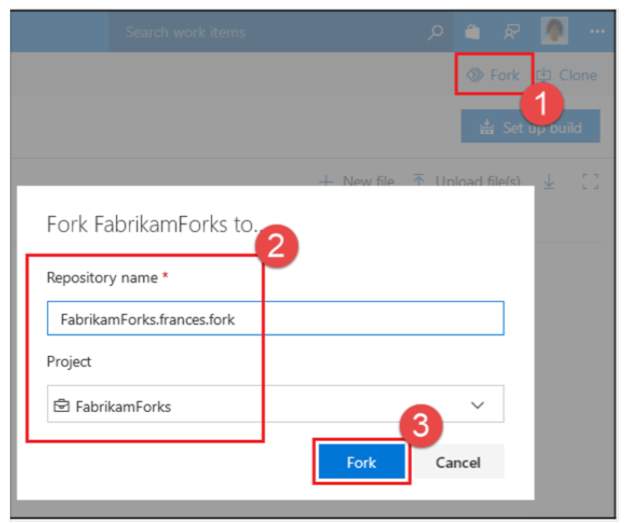

2. Once your fork is ready, clone it using the command line or an IDE, such as Visual Studio. The fork will be your origin remote. For convenience, you'll want to add the upstream repository (where you forked from) as a remote named upstream. On the command line, type:

```
git remote add upstream {upstream_url}
```
3. It's possible to work directly in the main – after all, this fork is your copy of the repo. We recommend you still work in a topic branch, though. It allows you to maintain multiple independent workstreams simultaneously. Also, it reduces confusion later when you want to sync changes into your fork. Make and commit your changes as you normally would. When you're done with the changes, push them to origin (your fork).

4. Open a pull request from your fork to the upstream. All the policies, required reviewers, and builds will be applied in the upstream repo. Once all the policies are satisfied, the PR can be completed, and the changes become a permanent part of the upstream repo:

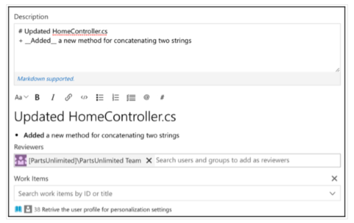

5. When your PR is accepted into upstream, you'll want to make sure your fork reflects the latest state of the repo. We recommend rebasing on the upstream's main branch (assuming the main is the main development branch). On the command line, run:

```
git fetch upstream main
git rebase upstream/main
git push origin
```

* [Clone an Existing Git repo.](https://docs.microsoft.com/en-us/azure/devops/repos/git/clone)
* [Azure Repos Git Tutorial](https://docs.microsoft.com/en-us/azure/devops/repos/git/gitworkflow)


## Manage Git repositories

### Purge repository data

While one of the benefits of Git is its ability to hold long histories for repositories efficiently, there are times when you need to purge data.

The most common situations are where you want to:

Significantly reduce the size of a repository by removing history.
* Remove a large file that was accidentally uploaded.
* Remove a sensitive file that shouldn't have been uploaded.
* If you commit sensitive data (for example, password, key) to Git, it can be removed from history. Two tools are commonly used:

### git filter-repo tool

The git filter-repo is a tool for rewriting history.

Its core filter-repo contains a library for creating history rewriting tools. Users with specialized needs can quickly create entirely new history rewriting tools.

### BFG Repo-Cleaner

BFG Repo-Cleaner is a commonly used open-source tool for deleting or "fixing" content in repositories. It's easier to use than the git filter-branch command. For a single file or set of files, use the --delete-files option:

```
$ bfg --delete-files file_I_should_not_have_committed
```

The following bash shows how to find all the places that a file called passwords.txt exists in the repository. Also, to replace all the text in it, you can execute the --replace-text option:

```
$ bfg --replace-text passwords.txt
```


For more information, see:

[Quickly rewrite git repository history.](https://github.com/newren/git-filter-repo/)

[Removing files from Git Large File Storage.](https://docs.github.com/repositories/working-with-files/managing-large-files/removing-files-from-git-large-file-storage)

[Removing sensitive data from a repository.](https://docs.github.com/authentication/keeping-your-account-and-data-secure/removing-sensitive-data-from-a-repository)

[BFG Repo Cleaner.](https://rtyley.github.io/bfg-repo-cleaner)

[Using Git LFS and VFS for Git introduction - Code With Engineering Playbook (microsoft.github.io).](https://microsoft.github.io/code-with-engineering-playbook/source-control/git-guidance/git-lfs-and-vfs/)
[https://docs.microsoft.com/en-us/azure/devops/repos/git/manage-large-files](https://docs.microsoft.com/en-us/azure/devops/repos/git/manage-large-files)
[https://docs.microsoft.com/en-us/azure/devops/repos/git/delete-existing-repo](https://docs.microsoft.com/en-us/azure/devops/repos/git/delete-existing-repo)
