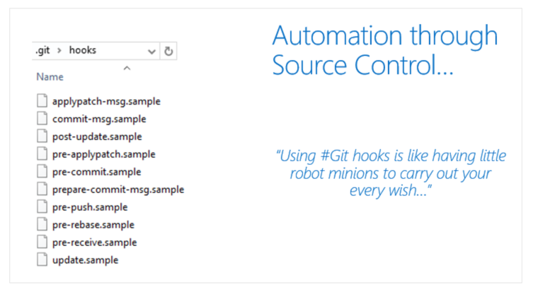
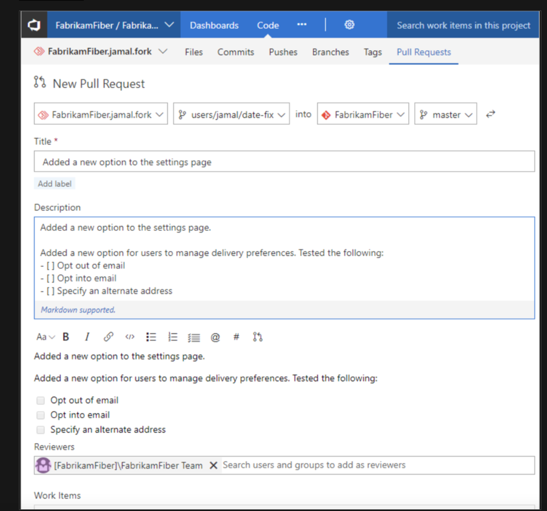
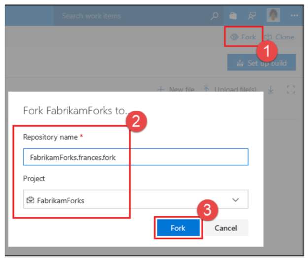
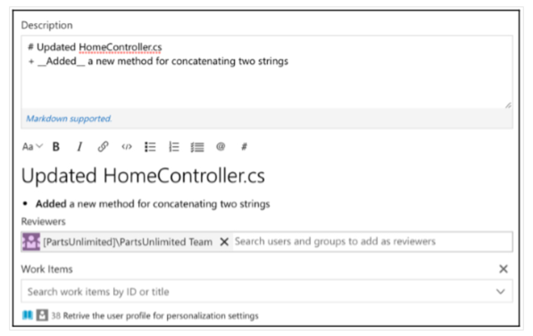

# Introduction to Git hooks

Continuous delivery demands a significant level of automation. You can't be continuously delivering if you don't have a quality codebase. It's where git fares so well.

It lets you automate most of the checks in your codebase. Even before committing the code into your local repository, let alone the remote.

## Git hooks

Git hooks are a mechanism that allows code to be run before or after certain Git lifecycle events.

For example, one could hook into the commit-msg event to validate that the commit message structure follows the recommended format.

The hooks can be any executable code, including shell, PowerShell, Python, or other scripts. Or they may be a binary executable. Anything goes!

The only criteria are that hooks must be stored in the .git/hooks folder in the repo root. Also, they must be named to match the related events (Git 2.x):

* applypatch-msg
* pre-applypatch
* post-applypatch
* pre-commit
* prepare-commit-msg
* commit-msg
* post-commit
* pre-rebase
* post-checkout
* post-merge
* pre-receive
* update
* post-receive
* post-update
* pre-auto-gc
* post-rewrite
* pre-push

## Practical use cases for using Git hooks

Since Git hooks execute the scripts on the specific event type they're called on, you can do much anything with Git hooks.

Some examples of where you can use hooks to enforce policies, ensure consistency, and control your environment:

* In Enforcing preconditions for merging
* Verifying work Item ID association in your commit message
* Preventing you & your team from committing faulty code
* Sending notifications to your team's chat room (Teams, Slack, HipChat, and so on.)

## So, where do I start?

Let's start by exploring client-side Git hooks.

Navigate to the repo.git\hooks directory.

You'll find that there are a bunch of samples, but they're disabled by default.

For instance, if you open that folder, you'll find a file called pre-commit.sample.

To enable it, rename it to pre-commit by removing the .sample extension and making the script executable.

When you attempt to commit using git commit, the script is found and executed.

If your pre-commit script exits with a 0 (zero), you commit successfully. Otherwise, the commit fails.



## PreCommit Git Hook to scan commit for keywords

How can Git hooks help with security?

You can invoke a script at pre-commit using Git hooks to scan the increment of code being committed into your local repository for specific keywords.

Replace the code in this pre-commit shell file with the below code.

```
#!C:/Program\ Files/Git/usr/bin/sh.exe
matches=$(git diff-index --patch HEAD | grep '^+' | grep -Pi 'password|keyword2|keyword3')
if [ ! -z "$matches" ]
then
    cat <<\EOT
Error: Words from the blocked list were present in the diff:
EOT
    echo $matches
    exit 1 
fi
```

You don't have to build the complete keyword scan list in this script.

You can branch off to a different file by referring it here to encrypt or scramble if you want to.

The repo .git\hooks folder isn't committed to source control, so you may ask how you share the goodness of the automated scripts you create with the team?

The good news is that from Git version 2.9, you can now map Git hooks to a folder that can be committed into source control.

You could do that by updating the global settings configuration for your git repository.

```
git config --global core.hooksPath '~/.GitHooks'
```

If you ever need to overwrite the Git Hooks, you have set up on the client-side. Also, you could do so by using the no-verify switch.

```
git commit --no-verify
```

## Server-side service hooks with Azure Repos

So far, we've looked at the client-side Git Hooks on Windows. Azure Repos also exposes server-side hooks. Azure DevOps uses the exact mechanism itself to create Pull requests. You can read more about it at the [Server hooks event reference.](https://docs.microsoft.com/en-us/azure/devops/service-hooks/events)

## Implement Git hooks

When pushing quality into the development process, developing code locally, you want developers to identify and catch code quality issues.

It's even before raising the pull request to trigger the branch policies.

Git hooks allow you to run custom scripts whenever certain important events occur in the Git life cycle—for example, committing, merging, and pushing.

Git ships with several sample hook scripts in the repo.git\hooks directory.

Since Git snares execute the contents on the particular occasion type they're approached, you can do practically anything with Git snares.

Here are a few instances of where you can use snares to uphold arrangements, guarantee consistency, and control your environment:

Enforcing preconditions for merging
Verifying work Item ID association in your commit message Preventing you and your team from committing faulty code
Sending notifications to your team's chat room (Teams, Slack, HipChat)
In this recipe, we'll use the pre-commit Git hook to scan the commit for keywords from a predefined list to block the commit if it contains any of these keywords.


# Plan foster inner source

## Explore foster inner source

The fork-based pull request workflow is popular with open-source projects because it allows anybody to contribute to a project.

You don't need to be an existing contributor or write access to a project to offer your changes.

This workflow isn't just for open source: forks also help support inner source workflows within your company.

Before forks, you could contribute to a project-using Pull Requests.

The workflow is simple enough: push a new branch up to your repository, open a pull request to get a code review from your team, and have Azure Repos evaluate your branch policies.

You can click one button to merge your pull request into main and deploy when your code is approved.

This workflow is great for working on your projects with your team. But what if you notice a simple bug in a different project within your company and you want to fix it yourself?

What if you're going to add a feature to a project that you use, but another team develops?

It's where forks come in; forks are at the heart of inner source practices.

## Inner source

Inner source – sometimes called "internal open source" – brings all the benefits of open-source software development inside your firewall.

It opens your software development processes so that your developers can easily collaborate on projects across your company.

It uses the same processes that are popular throughout the open-source software communities.

But it keeps your code safe and secure within your organization.

Microsoft uses the inner source approach heavily.

As part of the efforts to standardize a one-engineering system throughout the company – backed by Azure Repos – Microsoft has also opened the source code to all our projects to everyone within the company.


Before the move to the inner source, Microsoft was "siloed": only engineers working on Windows could read the Windows source code.

Only developers working on Office could look at the Office source code.

So, if you're an engineer working on Visual Studio and you thought that you found a bug in Windows or Office – or wanted to add a new feature – you're out of luck.

But by moving to offer inner sources throughout the company, powered by Azure Repos, it's easy to fork a repository to contribute back.

As an individual making the change, you don't need to write access to the original repository, just the ability to read it and create a fork.


## Implement the fork workflow

A fork is a copy of a repository. Forking a repository allows you to experiment with changes without affecting the original project freely.

Most commonly, forks are used to propose changes to someone else's project. Or use someone else's project as a starting point for your idea.

A fork is a complete copy of a repository, including all files, commits, and (optionally) branches.

Forks are a great way to support an Inner Source workflow: you can create a fork to suggest changes when you don't have permission to write to the original project directly.

Once you're ready to share those changes, it's easy to contribute them back-using pull requests.

## What's in a fork?

A fork starts with all the contents of its upstream (original) repository.

You can include all branches or limit them to only the default branch when you create a fork.

None of the permissions, policies, or build pipelines are applied.

The new fork acts as if someone cloned the original repository, then pushed it to a new, empty repository.

After a fork has been created, new files, folders, and branches aren't shared between the repositories unless a Pull Request (PR) carries them along.


## Sharing code between forks

You can create PRs in either direction: from fork to upstream or upstream to fork.

The most common approach will be from fork to upstream.

The destination repository's permissions, policies, builds, and work items will apply to the PR.

## Choosing between branches and forks

For a small team (2-5 developers), we recommend working in a single repo.

Everyone should work in a topic branch, and the main should be protected with branch policies.

As your team grows more significant, you may find yourself outgrowing this arrangement and prefer to switch to a forking workflow.

We recommend the forking workflow if your repository has many casual or infrequent committees (like an open-source project).

Typically, only core contributors to your project have direct commit rights into your repository.

It would help if you asked collaborators from outside this core set of people to work from a fork of the repository.

Also, it will isolate their changes from yours until you've had a chance to vet the work.

## The forking workflow

* Create a fork.
* Clone it locally.
* Make your changes locally and push them to a branch.
* Create and complete a PR to upstream.
* Sync your fork to the latest from upstream.

## Create the Fork


1.Navigate to the repository to fork and choose fork.

2.Specify a name and choose the project where you want the fork to be created. If the repository contains many topic branches, we recommend you fork only the default branch.

3.Choose the ellipsis, then Fork to create the fork.

```
You must have the Create Repository permission in your chosen project to create a fork. We recommend you create a dedicated project for forks where all contributors have the Create Repository permission. For an example of granting this permission, see Set Git repository permissions.
```

## Clone your fork locally

Once your fork is ready, clone it using the command line or an IDE like Visual Studio. The fork will be your origin remote.

For convenience, after cloning, you'll want to add the upstream repository (where you forked from) as a remote named upstream.

```
git remote add upstream {upstream_url}
```

## Make and push changes

It's possible to work directly in main - after all, this fork is your copy of the repo.

We recommend you still work in a topic branch, though.

It allows you to maintain multiple independent workstreams simultaneously.

Also, it reduces confusion later when you want to sync changes into your fork.

Make and commit your changes as you normally would. When you're done with the changes, push them to origin (your fork).

## Create and complete a PR

Open a pull request from your fork to the upstream. All the policies required reviewers and builds will be applied in the upstream repo. Once all policies are satisfied, the PR can be completed, and the changes become a permanent part of the upstream repo.



## Sync your fork to the latest

When you've gotten your PR accepted into upstream, you'll want to make sure your fork reflects the latest state of the repo.

We recommend rebasing on upstream's main branch (assuming main is the main development branch).

```
git fetch upstream main
git rebase upstream/main
git push origin
```

The forking workflow lets you isolate changes from the main repository until you're ready to integrate them. When you're ready, integrating code is as easy as completing a pull request.


## Describe inner source with forks

People fork repositories when they want to change the code in a repository that they don't have write access to.

If you don't have write access, you aren't part of the team contributing to that repository, so why would you modify the code repository?

In our line of work, we tend to look for technical reasons to improve something.

You may find a better way of implementing the solution or enhancing the functionality by contributing to or improving an existing feature.

You can fork repositories in the following situations:

I want to make a change.
I think the project is exciting and may want to use it in the future.
I want to use some code in that repository as a starting point for my project.
Software teams are encouraged to contribute to all projects internally, not just their software projects.

Forks are a great way to foster a culture of inner open source.

Forks are a recent addition to the Azure DevOps Git repositories.

This recipe will teach you to fork an existing repository and contribute changes upstream via a pull request.

## Getting ready

A fork starts with all the contents of its upstream (original) repository.

When you create a fork in the Azure DevOps, you can include all branches or limit them to only the default branch.

A fork doesn't copy the permissions, policies, or build definitions of the repository being forked.

After a fork has been created, the newly created files, folders, and branches aren't shared between the repositories unless you start a pull request.

Pull requests are supported in either direction: from fork to upstream or upstream to fork.

The most common approach for a pull request will be from fork to upstream.

## How to do it

1. Choose the Fork button (1), and then select the project where you want the fork to be created (2). Give your fork a name and choose the Fork button (3).



2. Once your fork is ready, clone it using the command line or an IDE, such as Visual Studio. The fork will be your origin remote. For convenience, you'll want to add the upstream repository (where you forked from) as a remote named upstream. On the command line, type:

```
git remote add upstream {upstream_url}
```
3. It's possible to work directly in the main – after all, this fork is your copy of the repo. We recommend you still work in a topic branch, though. It allows you to maintain multiple independent workstreams simultaneously. Also, it reduces confusion later when you want to sync changes into your fork. Make and commit your changes as you normally would. When you're done with the changes, push them to origin (your fork). 

4. Open a pull request from your fork to the upstream. All the policies, required reviewers, and builds will be applied in the upstream repo. Once all the policies are satisfied, the PR can be completed, and the changes become a permanent part of the upstream repo:



5. When your PR is accepted into upstream, you'll want to make sure your fork reflects the latest state of the repo. We recommend rebasing on the upstream's main branch (assuming the main is the main development branch). On the command line, run:

```
git fetch upstream main
git rebase upstream/main
git push origin
```

* [Clone an Existing Git repo.](https://docs.microsoft.com/en-us/azure/devops/repos/git/clone)
* [Azure Repos Git Tutorial](https://docs.microsoft.com/en-us/azure/devops/repos/git/gitworkflow)


## Manage Git repositories 

### Purge repository data

While one of the benefits of Git is its ability to hold long histories for repositories efficiently, there are times when you need to purge data.

The most common situations are where you want to:

Significantly reduce the size of a repository by removing history.
* Remove a large file that was accidentally uploaded.
* Remove a sensitive file that shouldn't have been uploaded.
* If you commit sensitive data (for example, password, key) to Git, it can be removed from history. Two tools are commonly used:

### git filter-repo tool

The git filter-repo is a tool for rewriting history.

Its core filter-repo contains a library for creating history rewriting tools. Users with specialized needs can quickly create entirely new history rewriting tools.

### BFG Repo-Cleaner

BFG Repo-Cleaner is a commonly used open-source tool for deleting or "fixing" content in repositories. It's easier to use than the git filter-branch command. For a single file or set of files, use the --delete-files option:

```
$ bfg --delete-files file_I_should_not_have_committed
```

The following bash shows how to find all the places that a file called passwords.txt exists in the repository. Also, to replace all the text in it, you can execute the --replace-text option:

```
$ bfg --replace-text passwords.txt
```


For more information, see:

[Quickly rewrite git repository history.](https://github.com/newren/git-filter-repo/)

[Removing files from Git Large File Storage.](https://docs.github.com/repositories/working-with-files/managing-large-files/removing-files-from-git-large-file-storage)

[Removing sensitive data from a repository.](https://docs.github.com/authentication/keeping-your-account-and-data-secure/removing-sensitive-data-from-a-repository)

[BFG Repo Cleaner.](https://rtyley.github.io/bfg-repo-cleaner)

[Using Git LFS and VFS for Git introduction - Code With Engineering Playbook (microsoft.github.io).](https://microsoft.github.io/code-with-engineering-playbook/source-control/git-guidance/git-lfs-and-vfs/)
[https://docs.microsoft.com/en-us/azure/devops/repos/git/manage-large-files](https://docs.microsoft.com/en-us/azure/devops/repos/git/manage-large-files)
[https://docs.microsoft.com/en-us/azure/devops/repos/git/delete-existing-repo](https://docs.microsoft.com/en-us/azure/devops/repos/git/delete-existing-repo)
