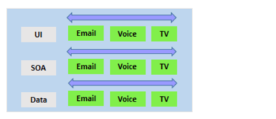
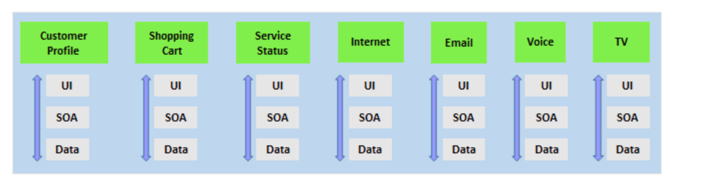

# Describe team structure

Starting to apply Agile practices in your company is not easy. 

It demands collaboration from your teams, stakeholder support, and training.

## Explore agile development practices

### Waterfall

Traditional software development practices involve:

Determining a problem.
Analyzing the requirements.
Building and testing the required code.
The delivery outcome to users.
Usually, all refer to as a waterfall approach.

The waterfall model follows a sequential order. A project development team only moves to the next development phase or testing if the previous step is completed successfully.

It is what an engineer would do when building a bridge or a building. So, it might seem appropriate for software projects as well.

However, the waterfall methodology has some drawbacks. One relates to the customer requirements.

For example, It does not matter if the customer requirements are defined accurately at the start of a project.

Usually, the project takes a long time, and the outcome may no longer match the customer's needs.

There is a real challenge with the gathering of customer requirements in the first place.

Taking a long time to deliver something would often be different from what the customer need. Even if you built exactly what the customer asked.

Customers often do not know what they want until they see it or cannot explain what they need.

### Agile

By comparison, Agile methodology constantly emphasizes adaptive planning and early delivery with continual improvement.

Rather than restricting development to rigid specifications, it encourages rapid and flexible responses to change as they occur.

In 2001, a group of highly regarded developers published a manifesto for Agile software development.

They said that:

* Development needs to favor individuals and interactions over processes and tools.
* Working software over comprehensive documentation.
* Customer collaboration over contract negotiation.
* Respond to changes over following a plan.

Agile software development methods are based on releases and iterations:

* One release might consist of several iterations.

* Each iteration is like a small independent project.

* After being estimated and prioritization:
    * Features, bug fixes, enhancements, and refactoring width are assigned to a release.
    * And then assigned again to a specific iteration within the release, generally on a priority basis.

* At the end of each iteration, they should be tested working code.

* In each iteration, the team must focus on the outcomes of the previous iteration and learn from it.

An advantage of having teams focused on shorter-term outcomes is that teams are also less likely to waste time over-engineering features. Or allowing unnecessary scope creep to occur.

Agile software development helps teams keep focused on business outcomes.

## Explore principles of agile development

The [Agile Alliance](https://www.agilealliance.org/) says its mission is to support people who explore and apply agile values and principles. Also, practices to make building software solutions more effective, humane, and sustainable.

They have published a [Manifesto for Agile Software Development](https://www.agilealliance.org/agile101/the-agile-manifesto/).

And from the publish, they have distilled the [12 Principles Behind the Agile Manifesto.](https://www.agilealliance.org/agile101/12-principles-behind-the-agile-manifesto/)

* Our highest priority is to satisfy the customer through early and continuous delivery of valuable software.
  
* Welcome changing requirements, even late in development. Agile processes harness change for the customer's competitive advantage.

* Deliver working software frequently, from a couple of weeks to a couple of months, with a preference to the shorter timescale.

* Businesspeople and developers must work together daily throughout the project.

* Build projects around motivated individuals. Give them the environment and support they need and trust them to get the job done.

* The most efficient and effective method of conveying information to and within a development team is face-to-face conversation.

* Working software is the primary measure of progress.

* Agile processes promote sustainable development. The sponsors, developers, and users should be able to maintain a constant pace indefinitely.

* Continuous attention to technical excellence and good design enhances agility.
  
* Simplicity - the art of maximizing the amount of work not done - is essential.

* The best architectures, requirements, and designs emerge from self-organizing teams.
At regular intervals, the team reflects on how to become more effective, then tunes and adjusts its behavior accordingly.
  

## Define organization structure for agile practices

For most organizations, reorganizing to be agile is difficult. It requires a mind-shift and a culture-shift that challenges many existing policies and processes within the organization.

Good governance in organizations, particularly in large organizations, often leads to many relatively rigid rules, operating structures, and methods. It also tends to avoid a broad delegation of authority.

While most large organizations have not moved to an agile structure, most are now experimenting with doing so.

Their business environments are volatile and complex, and they have seen the limitations of their current systems, mainly an inability to cope with change quickly.

They realize that it is common today for long-term established businesses and their industries to be disrupted by startups.

### Horizontal vs. vertical teams
Traditionally, horizontal team structures divide teams according to the software architecture. In this example, the teams have been divided into the user interface, service-oriented architecture, and data teams:

By comparison, vertical team structures span the architecture and are aligned with skillsets or disciplines:

Vertical teams have been shown to provide more good outcomes in Agile projects. Each product must have an identified owner.

Another key benefit of the vertical team structure is that scaling can occur by adding teams. In this example, feature teams have been created rather than just project teams:

## Explore ideal DevOps team members

For a successful DevOps transformation, the aim is to find team members with the following characteristics:

* They already think there is a need to change.
* They have previously shown an ability to innovate.
* They are already well respected within the organization.
* They have a broad knowledge of the organization and how it operates.
* Ideally, they already believe that DevOps practices are what is needed.

### Mentoring team members on agile practices

While it's desirable to have formal agile training for staff members, no matter how good any agile course is, there is a world of difference between learning a concept within a few days and putting it into practice.

When they first start an agile transformation, many teams hire external coaches or mentors.

Agile coaches help teams or individuals to adopt agile methods or to improve the current techniques and practices.

They must be agents of change by helping people understand how they work and encouraging them to adopt new approaches.

Agile coaches typically work with more than one team and remove any roadblocks from inside or outside the organization.

This work requires various skills, including coaching, mentoring, teaching, and making easier. Agile coaches must be both trainers and consultants.

There is more than one type of agile coach.

* Some coaches are technical experts who aim to show staff members how to apply specific concepts—for example, test-driven development and continuous integration or deployment.
  * These coaches might do peer programming sessions with staff members.
  
* Other coaches are focused on agile processes, determining requirements, and managing work activities.
  * They might help how to run effective stand-up and review meetings.
  * Some coaches may themselves act as scrum masters.
    * They might mentor staff in how to fill these roles.
  
Over time, though, team members need to develop an ability to mentor each other. Teams should aim to be self-organizing. Team members are often expected to learn as they work and to acquire skills from each other. To make it effective, though, the work itself needs to be done collaboratively, not by individuals working by themselves.

## Enable in-team and cross-team collaboration

Effective collaboration is critical for well-functioning Agile teams. Enabling it requires both cultural changes, cross-functional team collaboration, and tooling.

### Cultural changes

Over recent decades, offices have often become open spaces with few walls. At the time of writing, a significant shift to working from home has started, started as a response to the pandemic. Both situations can limit collaboration, and ambient noise and distractions often also reduce productivity. Staff tends to work better when they have comfortable working environments. Defined meeting times and locations let teams choose when they want to interact with others.

Asynchronous communication should be encouraged, but there should not be an expectation that all communications will be responded to urgently. Staff should focus on their primary tasks without feeling like they are being left out of important decisions.

All meetings should have strict timeframes, and more importantly, have a plan. If there is no plan, there should be no meeting.

As it is becoming harder to find the required staff, great teams will be as comfortable with remote or work-from-home workers in the office.

To be successful, though, collaboration via communication should become part of the organization's DNA.

Staff should be encouraged to communicate openly and frankly. Learning to deal with conflict is essential for any team, as there will be disagreements at some point. Mediation skills training would be helpful.

### Cross-functional teams

Team members need good collaboration. It is also essential to have a great partnership with wider teams to bring people with different functional expertise together to work toward a common goal.

Often, there will be people from other departments within an organization.

Faster and better innovation can occur in these cross-functional teams.

People from different areas of the organization will have different views of the same problem, and they are more likely to come up with alternate solutions to problems or challenges. Existing entrenched ideas are more likely to be challenged.

Cross-functional teams can also minimize turf-wars within organizations. The more widely that a project appears to have ownership, the easier it will be to be widely accepted. Bringing cross-functional teams together also helps to spread knowledge across an organization.

Recognizing and rewarding collective behavior across cross-functional teams can also help to increase team cohesion.

### Collaboration tooling

Agile teams commonly use the following collaboration tools:

Agile teams commonly use the following collaboration tools:

[Teams (Microsoft)](https://products.office.com/microsoft-teams/group-chat-software) A group chat application from Microsoft. It provides a combined location with workplace chat, meetings, notes, and storage of file attachments. A user can be a member of many teams.

[Slack](https://slack.com/) is A commonly used tool for collaboration in Agile and DevOps teams. From a single interface, it provides a series of separate communication channels that can be organized by project, team, or topic. Conversations are kept and are searchable. It is straightforward to add both internal and external team members. Slack integrates with many third-party tools like GitHub for source code and DropBox for document and file storage.

[Jira](https://www.atlassian.com/software/jira) is A commonly used tool that allows for planning, tracking, releasing, and reporting.

[Asana](https://asana.com/) is A standard tool designed to keep team plans, progress, and discussions in a single place. It has strong capabilities around timelines and boards.

[Glip](https://glip.com/) is An offering from Ring Central that provides chat, video, and task management.

Other standard tools that include collaboration offerings include ProofHub, RedBooth, Trello, DaPulse, and many others.

### Collaboration tools

### Select tools and processes for agile practices

While developing using agile methods does not require specific tooling, tools can often enhance the outcomes achieved.

It is essential to realize that the vital tool for agile development is the process itself.

Become familiar with the procedures that you need to follow before working out how to implement tools. Several categories of tools are commonly used.

### Physical tools

Not all tools need to be digital tools. Many teams make extensive use of whiteboards for collaborating on ideas, index cards for recording stories, and sticky notes for moving around tasks.

Even when digital tools are available, it might be more convenient to use these physical tools during stand-up and other meetings.

### Project management tools

These tools usually include:

* Project planning and execution monitoring abilities (including how to respond to impediments).
* Automation for stand-up meetings.
* Management and tracking of releases.
* A way to record and work with the outcomes of retrospectives.
* Many include Kanban boards and detailed sprint planning options.
These tools will also provide detailed visualizations, often as a graphic dashboard that shows team progress against assigned goals and targets.

Some tools also integrate directly with code repositories and CI/CD tools and add code-related metrics, including quality metrics, along with direct support for code reviews.

And a complete CI/CD system, Azure DevOps includes:

* Flexibility in Kanban boards.
* Traceability through Backlogs.
* Customizability in dashboards.
* Built-in scrum boards.
* Integrability directly with code repositories.
* Code changes can be linked directly to tasks or bugs.

Apart from Azure DevOps, other standard tools include:

GitHub.
Jira.
Trello.
Active Collab.
Agilo for Scrum.
SpiraTeam.
Icescrum.
SprintGround.
Gravity.
Taiga.
VersionOne.
Agilean.
Wrike.
Axosoft.
Assembla.
PlanBox.
Asana.
Binfire.
Proggio.
VivifyScrum, and many others.

### Screen recording tools

It might seem odd to add screen recording tools to this list. Still, they are beneficial when:

Work with remote team members.
Recording bugs in action.
Building walkthroughs and tutorials that demonstrate actual or potential features.
A screen recorder is built into Windows, but other common ones include SnagIt, Camtasia, OBS, and Loom.

More Details

[DevOps vs. Agile | Microsoft Azure.](https://azure.microsoft.com/overview/devops-vs-agile/)

[Best practices for Agile project management - Azure Boards | Microsoft Docs.](https://docs.microsoft.com/en-us/azure/devops/boards/best-practices-agile-project-management)

[Agile Manifesto for Software Development | Agile Alliance.](https://www.agilealliance.org/agile101/the-agile-manifesto)

[Agile Board | Trello.](https://trello.com/b/DnZvFigA/agile-board)

[Agile Alliance.](https://www.agilealliance.org/)

[12 Principles Behind the Agile Manifesto | Agile Alliance.](https://www.agilealliance.org/agile101/12-principles-behind-the-agile-manifesto)

[Jira | Issue & Project Tracking Software | Atlassian.](https://www.atlassian.com/software/jira)

