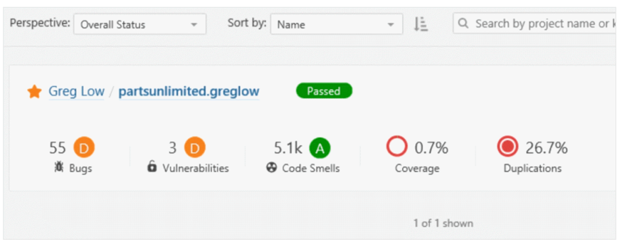
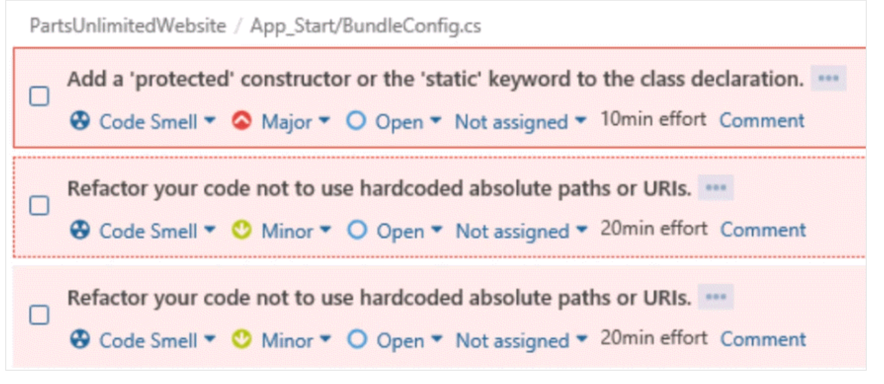
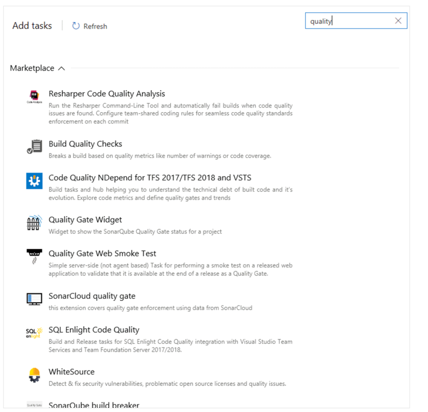

#  Identify technical debt 


## Examine code quality

The quality of code shouldn't be measured subjectively.

A developer-writing code would rate the quality of their code high, but that isn't a great way to measure code quality.

Different teams may use different definitions based on context.

Code that is considered high quality may mean one thing for an automotive developer.

And it may mean another for a web application developer.

The quality of the code is essential, as it impacts the overall software quality.

A study on "Software Defect Origins and Removal Methods" found that individual programmers are less than 50% efficient at finding bugs in their software.

And most forms of testing are only 35% efficient. It makes it difficult to determine quality.

There are five key traits to measure for higher quality.

### Reliability

Reliability measures the probability that a system will run without failure over a specific period of operation.

It relates to the number of defects and availability of the software. Several defects can be measured by running a static analysis tool.

Software availability can be measured using the mean time between failures (MTBF).

Low defect counts are crucial for developing a reliable codebase.

### Maintainability

Maintainability measures how easily software can be maintained. It relates to the size, consistency, structure, and complexity of the codebase.

And ensuring maintainable source code relies on several factors, such as testability and understandability.

You can't use a single metric to ensure maintainability.

Some metrics you may consider to improve maintainability are the number of stylistic warnings and Halted complexity measures.

Both automation and human reviewers are essential for developing maintainable codebases.

### Testability

Testability measures how well the software supports testing efforts.

It relies on how well you can control, observe, isolate, and automate testing, among other factors.

Testability can be measured based on how many test cases you need to find potential faults in the system.

The size and complexity of the software can impact testability.

So, applying methods at the code level—such as cyclomatic complexity—can help you improve the testability of the component.

### Portability

Portability measures how usable the same software is in different environments. It relates to platform independence.

There isn't a specific measure of portability. But there are several ways you can ensure portable code.

It's essential to regularly test code on different platforms rather than waiting until the end of development.

It's also a good idea to set your compiler warning levels as high as possible—and use at least two compilers.

Enforcing a coding standard also helps with portability.


### Reusability

Reusability measures whether existing assets—such as code—can be used again.

Assets are more easily reused if they have characteristics such as modularity or loose coupling.

Reusability can be measured by the number of interdependencies.

Running a static analyzer can help you identify these interdependencies.


## Examine complexity and quality metrics

While there are various quality metrics, a few of the most important ones are listed here.

Complexity metrics can help in measuring quality. Cyclomatic complexity measures the number of linearly independent paths through a program's source code. Another way to understand quality is through calculating Halted's complexity measures.

This measure:

* Program vocabulary.
* Program length.
* Calculated program length.
* Volume.
* Difficulty.
* Effort.

Code analysis tools can be used to check for considerations such as security, performance, interoperability, language usage, globalization and should be part of every developer's toolbox and software build process.

Regularly running a static code analysis tool and reading its output is a great way to improve as a developer because the things caught by the software rules can often teach you something.

### Common-quality-related metrics

One of the promises of DevOps is to deliver software both faster and with higher quality. Previously, these two metrics have been almost opposites. The more quickly you went, the lower the quality. The higher the quality, the longer it took. But DevOps processes can help you find problems earlier, which usually means that they take less time to fix.

We've previously talked about some general project metrics and KPIs. The following is a list of metrics that directly relate to the quality of the code being produced and the build and deployment processes.

* <b>Failed builds percentage</b> - Overall, what percentage of builds are failing?
* <b>Failed deployments percentage</b> -  Overall, what percentage of deployments are failing?
* <b>Ticket volume</b> - What is the overall volume of customer or bug tickets?
* <b>Bug bounce percentage</b> -  What percentage of customer or bug tickets are being reopened?
* <b>Unplanned work percentage</b> - What percentage of the overall work being performed is unplanned?

## Introduction to technical debt

<b>Technical debt</b> is a term that describes the future cost that will be incurred by choosing an easy solution today instead of using better practices because they would take longer to complete.

The term-technical debt was chosen for its comparison to financial debt. It's common for people in financial debt to make decisions that seem appropriate or the only option at the time, but in so doing, interest increases.

The more interest that accumulates, the harder it is for them in the future and the more minor options available to them later. With financial debt, soon, interest increases on interest, creating a snowball effect. Similarly, technical debt can build up to the point where developers spend almost all their time sorting out problems and doing rework, either planned or unplanned, rather than adding value.

So, how does it happen?

The most common excuse is tight deadlines. When developers are forced to create code quickly, they'll often take shortcuts. For example, instead of refactoring a method to include new functionality, let us copy to create a new version. Then I only test my new code and can avoid the level of testing required if I change the original method because other parts of the code use it.

Now I have two copies of the same code that I need to modify in the future instead of one, and I run the risk of the logic diverging. There are many causes. For example, there might be a lack of technical skills and maturity among the developers or no clear product ownership or direction.

The organization might not have coding standards at all. So, the developers didn't even know what they should be producing. The developers might not have precise requirements to target. Well, they might be subject to last-minute requirement changes.

Necessary-refactoring work might be delayed. There might not be any code quality testing, manual or automated. In the end, it just makes it harder and harder to deliver value to customers in a reasonable time frame and at a reasonable cost.


Technical debt is one of the main reasons that projects fail to meet their deadlines.

Over time, it increases in much the same way that monetary debt does. Common sources of technical debt are:


* Lack of coding style and standards.
* Lack of or poor design of unit test cases.
* Ignoring or not-understanding object orient design principles.
* Monolithic classes and code libraries.
* Poorly envisioned the use of technology, architecture, and approach. (Forgetting that all system attributes, affecting maintenance, user experience, scalability, and others, need to be considered). 
* Over-engineering code (adding or creating code that isn't required, adding custom code when existing libraries are sufficient, or creating layers or components that aren't needed).
* Insufficient comments and documentation.
* Not writing self-documenting code (including class, method, and variable names that are descriptive or indicate intent).
* Taking shortcuts to meet deadlines.
* Leaving dead code in place.

```
Over time, the technical debt must be paid back. Otherwise, the team's ability to fix issues and implement new features and enhancements will take longer and eventually become cost-prohibitive.
```

We have seen that technical debt adds a set of problems during development and makes it much more difficult to add extra customer value.

Having technical debt in a project saps productivity, frustrates development teams, makes code both hard to understand and fragile, increases the time to make changes and validate those changes. Unplanned work frequently gets in the way of planned work.

Longer-term, it also saps the organization's strength. Technical debt tends to creep up on an organization. It starts small and grows over time. Every time a quick hack is made or testing is circumvented because changes need to be rushed through, the problem grows worse and worse. Support costs get higher and higher, and invariably, a serious issue arises.

Eventually, the organization can't respond to its customers' needs in a timely and cost-efficient way.


### Automated measurement for monitoring

One key way to minimize the constant acquisition of technical debt is to use automated testing and assessment.

In the demos that follow, we'll look at one of the common tools used to assess the debt: SonarCloud. (The original on-premises version was SonarQube).

There are other tools available, and we'll discuss a few of them.

Later, in the next hands-on lab, you'll see how to configure your Azure Pipelines to use SonarCloud, understand the analysis results, and finally how to configure quality profiles to control the rule sets that are used by SonarCloud when analyzing your projects.

For more information, see [SonarCloud.](https://sonarcloud.io/about)

### To review:

Azure DevOps can be integrated with a wide range of existing tooling used to check code quality during builds.

### Measure and manage technical debt

Integrating the assessment and measurement of technical debt and code quality overall is essential as part of your Continuous Integration and Deployment pipelines in Azure DevOps.

In the Continuous Integration course in this series, we showed how to add support for SonarCloud into an Azure DevOps pipeline.

After it's added and a build done, you can see an analysis of your code:



If you drill into the issues, you can see what the issues are, along with suggested remedies and estimates of the time required to apply a remedy.



### Integrate other code quality tools

### Resharper Code Quality Analysis

Resharper can make a code quality analysis from the command line. Also, be set to fail builds when code quality issues are found automatically.

Rules can be configured for enforcement across teams.

### Search in Azure DevOps

To find other code quality tools that are easy to integrate with Azure DevOps, search for the word Quality when adding a task into your build pipeline.



For more information, you can see:

* [NDepend](https://www.ndepend.com/)
* Visual Studio marketplace
* Resharper Code Quality Analysis


### Plan effective code reviews

Most developers would agree that code reviews can improve the quality of the applications they produce, but only if the process for the code reviews is effective. It is essential, upfront, to agree that everyone is trying to achieve better code quality.

Achieving code quality can seem to challenge because there's no single best way to write any piece of code, at least code with any complexity. Everyone wants to do good work and to be proud of what they create.

It means that it's easy for developers to become over-protective of their code. The organizational culture must let all involved feel that the code reviews are more like mentoring sessions where ideas about improving code are shared than interrogation sessions where the aim is to identify problems and blame the author.

The knowledge-sharing that can occur in mentoring-style sessions can be one of the most important outcomes of the code review process. It often happens best in small groups (even two people) rather than in large team meetings. And it's important to highlight what has been done well, not just what needs improvement.

Developers will often learn more in effective code review sessions than they'll in any formal training. Reviewing code should be an opportunity for all involved to learn, not just as a chore that must be completed as part of a formal process.

It's easy to see two or more people working on a problem and think that one person could have completed the task by themselves. That is a superficial view of the longer-term outcomes.

Team management needs to understand that improving the code quality reduces the cost of code, not increases it. Team leaders need to establish and foster an appropriate culture across their teams.


