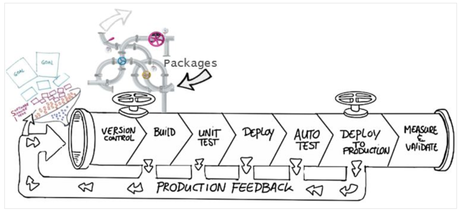

# Explore benefits of source control

"Code does not exist unless it is committed into source control. Source control is the fundamental enabler of continuous delivery."

Whether writing code professionally or personally, you should always version your code using a source control management system. Some of the advantages of using source control are,

* <b>Create workflows</b> - Version control workflows prevent the chaos of everyone using their development process with different and incompatible tools. Version control systems provide process enforcement and permissions, so everyone stays on the same page

* <b>Work with versions</b> - Every version has a description in the form of a comment. These descriptions help you follow changes in your code by version instead of by individual file changes. Code stored in versions can be viewed and restored from version control at any time as needed. It makes it easy to base new work on any version of code

* <b>Collaboration</b> - Version control synchronizes versions and makes sure that your changes do not conflict with other changes from your team. Your team relies on version control to help resolve and prevent conflicts, even when people make changes simultaneously.

* <b>Maintains history of changes.</b> - Version control keeps a record of changes as your team saves new versions of your code. This history can be reviewed to find out who, why, and when changes were made. The history gives you the confidence to experiment since you can roll back to a previous good version at any time. The history lets your base work from any code version, such as fixing a bug in an earlier release

* <b>Automate tasks</b> - Version control automation features save your team time and generate consistent results. Automate testing, code analysis, and deployment when new versions are saved to version control

## Common software development values

* <b>Reusability</b> - why do the same thing twice? Reuse of code is a common practice and makes building on existing assets simpler.

* <b>Traceability</b> -  Audits are not just for fun; in many industries, it is a legal matter. All activities must be traced, and managers can produce reports when needed. Traceability also makes debugging and identifying root cause easier. Additionally, it helps with feature reuse as developers can link requirements to implementation.

* <b>Manageability</b> - Can team leaders define and enforce workflows, review rules, create quality gates and enforce QA throughout the lifecycle?

* <b>Efficiency</b> - are we using the right resources for the job, minimizing time and effort? This one is self-explanatory.
  
* <b>Collaboration</b> - When teams work together, quality tends to improve. We catch one another's mistakes and can build on each other's strengths.

* <b>Learning</b> - Organizations benefit when they invest in employees learning and growing. It is important for onboarding new team members, the lifelong learning of seasoned members, and the opportunity for workers to contribute to the bottom line and the industry.

## Explore best practices for source control

* <b>Make small changes.</b> In other words, commit early and commit often. Be careful not to commit any unfinished work that could break the build.

* <b>Do not commit personal files.</b> It could include application settings or SSH keys. Often personal files are committed accidentally but cause problems later when other team members work on the same code.

* <b>Update often and right before pushing to avoid merge conflicts.</b>

* <b>Verify your code change before pushing it to a repository;</b> ensure it compiles and tests are passing.

* <b>Pay close attention to commit messages, as it will tell you why a change was made.</b> Consider committing messages as a mini form of documentation for the change.

* <b>Link code changes to work items.</b> It will concretely link what was created to why it was created—or modified by providing traceability across requirements and code changes.

* <b>No matter your background or preferences, be a team player and follow agreed conventions and workflows.</b> Consistency is essential and helps ensure quality, making it easier for team members to pick up where you left off, review your code, debug, and so on.